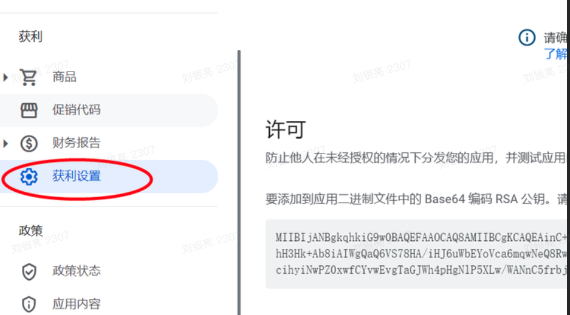
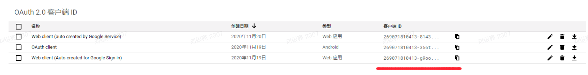
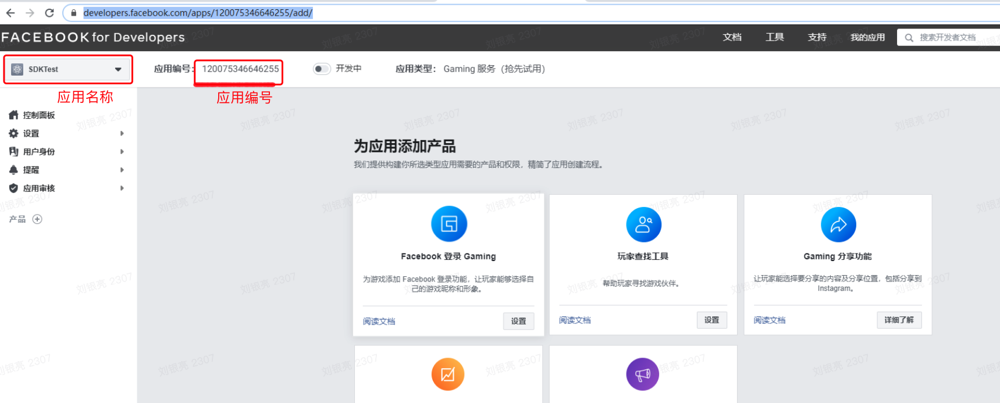

[<<返回首页](/sdk-docs)

Google 与 Facebook 参数申请指南
======

<!-- TOC -->

- [Google 参数申请](#google-参数申请)
            - [Googlekey 获取](#googlekey-获取)
            - [p_google_client_id 获取](#p_google_client_id-获取)
            - [Google 官方接入指南](#google-官方接入指南)
- [Facebook 参数获取](#facebook-参数获取)
            - [登录参数申请](#登录参数申请)
            - [社交信息维度](#社交信息维度)

<!-- /TOC -->

# Google 参数申请
- 接入 Google 账号或支付需要两个参数：[Googlekey, p_google_client_id]，这两个参数在 OmniSDK 后台的Google配置参数对应。

#### Googlekey 获取

- 登录 Google 开发者后台，进入【获利】功能页，在一下图示中位置获取许可，即 Googlekey：
  
    

#### p_google_client_id 获取
- 进入 Google 后台的应用配置中，找到 OAuth2.0 客户端ID，复制出来即可
  
    

#### Google 官方接入指南

[Google 接入官网](https://developers.google.com/identity/sign-in/android/start-integrating#configure_a_console_name_project)

# Facebook 参数获取
#### 登录参数申请
- 当前接入 Facebook 账号需要两个参数：[facebookAppId, facebookAppName]，这两个参数在 OmniSDK 后台的 Facebook 配置参数对应。
    1. facebookAppId ：应用ID
    2. facebookAppName ：应用名称
    

#### 社交信息维度
- 游戏需要获取更多的社交信息维度，需要在 Facebook 后台申请对应权限并在 OmniSDK 后台填写相应的维度字段。
    1. 用户社交账号信息 p_facebook_social_info，比如 picture
    2. 好友社交账号信息 p_facebook_friend_info，比如 picture,gender
    
- 信息维度[官方文档](https://developers.facebook.com/docs/graph-api/reference/user)