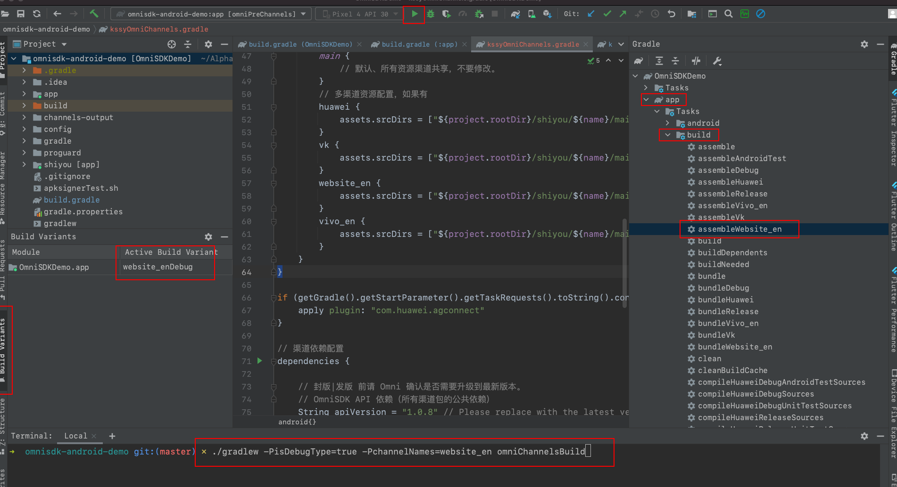
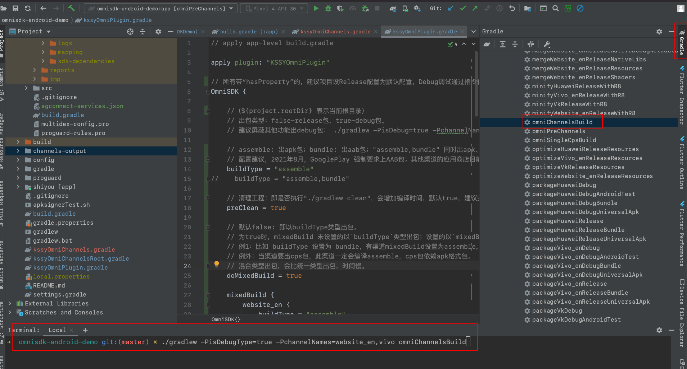

[<<返回首页](/sdk-docs)

OmniSDK KSSYOmniPlugin 渠道编译工具
=====

<!-- TOC -->

- [简介](#简介)
    - [集成](#集成)
    - [描述](#描述)
    - [版本变更记录](#版本变更记录)
    - [版本支持](#版本支持)
    - [KSSYOmniPlugin 技术路线](#kssyomniplugin-升级路线图)
    - [gradle.properties 配置](#gradleproperties-配置)
    - [1.0.3 升级 3.x 配置指南](#103-升级-3x-配置指南)
- [编译配置参数说明](#编译配置参数说明)
        - [OmniSDK-渠道编译参数](#omnisdk-渠道编译参数)
        - [OmniCPS-CPS标签包编译参数](#omnicps-cps标签包编译参数)
- [渠道编译](#渠道编译)
    - [渠道包的标识名](#渠道包的标识名)
    - [单渠道编译](#单渠道编译)
    - [多渠道编译](#多渠道编译)
- [CPS标签包编译](#cps标签包编译)
    - [功能说明](#功能说明)
    - [代码示例](#代码示例)
    - [命令执行](#命令执行)
- [如何配置](#如何配置)
    - [1. 集成配置](#1-集成配置)
    - [2. 编译配置示例](#2-编译配置示例)
    - [3. 编译指令示例](#3-编译指令示例)
    - [4. 渠道Demo 示例](#4-渠道demo-示例)
- [Android 标准目录参考](#android-标准目录参考)

<!-- /TOC -->

# 简介
`KSSYOmniPlugin` 基于 `Android-Gradle` 编译工具链开发的插件。直接集成于游戏工程源码内，方便游戏编译出包。

## 集成
集成请参考：[OmniSDK 集成配置](OmniSDKAndroid接入文档.md#集成配置)

## 描述
- Android Gradle Plugin(AGP) 版本对应关系：[官网](https://developer.android.com/studio/releases/gradle-plugin)。

- 依赖配置：

  ```groovy
  buildscript {
      repositories {
          // 金山世游仓库
          maven {
              url "https://maven.shiyou.kingsoft.com/repository/public/"
          }
      }
      dependencies {
          // 编译插件
          classpath("com.kingsoft.shiyou.omnisdk.build:plugin:$latest_version")
      }
  }
  ```

## 版本变更记录

| 版本  | 更新内容                                                     |
| ----- | ------------------------------------------------------------ |
| 3.1.0 :100: | 修改渠道资源替换路径的添加逻辑|
| 3.0.13 | 修复华为渠道编译问题|
| 3.0.12 | 1. 支持多渠道包编译；<br/>2. 支持AAB格式、混合编译；<br/>3. 支持CPS标签包出包；<br/>4. 支持各渠道包的资源文件动态编译、替换功能。<br/>5. 兼容 `AGP 3.4.3 & Gradle 5.3.1` 及以上，无法向下兼容。 |
| 1.0.3 | 1. 支持单个渠道包出包；<br/>2. 兼容 `AGP 3.3.3 & Gradle 4.10.3` 及以上。 |

## 版本支持

可 :left_right_arrow: 滑动

| AGP & Gradle   | Java8 | Kotlin | KSSYOmniPlugin | 技术支持截止日期 | 备注                                                         |
| -------------- | ---- | ------ | -------------- | ---------------- | ------------------------------------------------------------ |
| 4.1.2 & 6.5.1 :100: | 支持 | 支持   | 1.0.3 & 3.x    | 2025年12月     | 1. 不需要特殊编译配置<br/>2. `AGP4.x.x`建议使用游戏引擎支持的最高版本 |
| 3.6.4 & 5.6.4 :100: | 支持 | 支持   | 1.0.3 & 3.x    | 2023年12月     | 不需要特殊编译配置               |
| 3.5.4 & 5.5.1  | 支持 | 支持   | 1.0.3 & 3.x    | 2022年12月       | 不需要特殊编译配置                                           |
| 3.4.3 & 5.3.1  | 支持 | 支持   | 1.0.3 & 3.x    | 2022年12月       | 1. 不需要特殊编译配置<br/>2. 经测试`Kotlin 1.4.32 `及以下支持。 |
| 3.3.3 & 4.10.3 | 支持 | 不支持 | 1.0.3   | 不再升级维护     | 1. 除sunit(茄子渠道)外，需要在gradle.properties 里增加：<br/>`android.enableR8=true`<br/>`android.enableR8.fullMode=true`<br/>2. sunit(茄子渠道)配置：需要在gradle.properties 里增加：<br/>`android.enableR8=false`<br/>`android.enableR8.fullMode=true`<br/>并在 proguard-rules.pro 添加 `-ignorewarnings`<br/> |

## KSSYOmniPlugin 升级路线图

- KSSYOmniPlugin 升级路线将跟随 [AGP 升级路线](https://developer.android.com/studio/releases/gradle-plugin-roadmap)，并以最低兼容的 AGP 版本号升级。
- 跟随 AGP 升级将会导致部分功能不会向下兼容，也不会向下同步新功能。

| KSSYOmniPlugin | AGP          | 备注                         |
| -------------- | ------------ | ---------------------------- |
| 1.x            | 3.3.3 以前   | 不再升级维护                 |
| 3.x            | 3.3.3～3.x.x | 已发布，技术支持到2023年12月 |
| 4.x            | 4.x.x        | 开发中                       |
| 7.x            | 7.x.x        | 规划中                       |
| 8.x            | 8.x.x        | 规划中                       |

## gradle.properties 配置
```properties
# 建议增加编译内存大小
org.gradle.jvmargs=-Xmx4096m -Dfile.encoding=UTF-8
# 启用 androidx，必须配置
android.useAndroidX=true
# Automatically convert third-party libraries to use AndroidX
android.enableJetifier=true
```

## 1.0.3 升级 3.x 配置指南
- 删除工程里的 kssyOmni.gradle、kssyOmniRoot.gradle。
- 删除 app-level 下的 main/assets/shiyou/project_config.json。
- 联系 SDK 获取最新配置。
- 按 [OmniSDK 集成配置](OmniSDKAndroid接入文档.md#集成配置) 修改集成配置。

# 编译配置参数说明

可 :left_right_arrow: 滑动

### OmniSDK-渠道编译参数

| 参数名         | 功能             | 参数值                                                       | 默认值   | 备注                                                         |
| -------------- | ---------------- | ------------------------------------------------------------ | -------- | ------------------------------------------------------------ |
| buildType*      | 编译类型         | assemble,bundle                                              | assemble | 1. 渠道包默认编译类型；<br/>2. 如果需要同时出apk、aab格式，可配置"`assemble,bundle`"。 |
| preClean       | 清理工程         | Boolean                                                      | true     | 即是否执行"gradlew clean"，建议完整出包时设置为true          |
| doMixedBuild   | 是否混合类型编译 | Boolean                                                      | false    | 1. false：以 `buildType*` 类型编译；<br/>2. true：`mixedBuild` 未设置则以 `buildType*` 类型编译；设置则以 `mixedBuild-buildType` 类型编译。 |
| mixedBuild     | 混合编译配置     | mixedBuild {<br/>     Channel-Name {<br/>         buildType = "bundle"<br/>     }<br/> } | 无，可选    | 1. 渠道增加编译类型、或与默认编译类型不同时配置；<br/>2. 配置方式：`渠道名 { buildType = "编译类型"}`；<br/>3. buildType 同`buildType*`。 |
| debugBuild     | 出包类型：debug、release | Boolean                                                      | false    | 1. false：Debug包；<br/>2. true：Release包。 |
| logDebug       | 调试Log | Boolean                                                      | false    | 1. project_config.json#debugMode 开关；<br/>2. false：关闭SDK调试Log；<br/>3. true：开启SDK调试Log。 |
| customChannels | 指定部分渠道包编译 | String | all | 1. 不配置或"all"时出所有渠道包；<br/>2. 指定部分渠道包编译。 |
| output         | 产物输出路径 | 绝对路径 | 无 | 不配置默认输出到工程根目录下channels-output文件夹。 |
| skipCps        | 是否跳过cps标签包编译 | Boolean                                                      | false    | 1. false：跳过；<br/>2. true：编译CPS包，需要配置cpsChannels，否则无效。 |
| cpsChannels    | cps标签文件 | 渠道名 | 无 | 1. 配置渠道名；<br/>2. 对应shiyou目录下的渠道目录必须配置cps文件；<br/>3. 文件名“cps”：一行一个标签包，整个文件不要有空格行，例 `cpsName,outAlias` 为一行，参考[文件](./res/cps)；<br/>4. 标签包默认命名：`cps-{cpsName}-app-{channel}-release.apk`，配置`outAlias`别名时，输出名`outAlias.apk` |

### OmniCPS-CPS标签包编译参数

| 参数名  | 功能         | 参数值       | 备注                                                         |
| ------- | ------------ | ------------ | ------------------------------------------------------------ |
| baseApk | 基础apk      | 绝对路径文件 | 签过名的基础apk，且未打入cps信息，不满足无效。               |
| cpsFile | cps标签文件  | 绝对路径文件 | 同cpsChannels                                                |
| output  | 产物输出路径 | 绝对路径     | 不配置默认输出到工程根目录下channels-output/single-cps/文件夹。 |

# 渠道编译

## 渠道包的标识名
- 每个渠道包的标识名是由 Omni 定义好的，不可更改。
- 当前渠道包标识名，**可查看配置文件** `project_config.json#channel.channel_name`
- `/shiyou/**` 目录内的渠道文件夹名，必须与当前渠道包标识名一样。

## 单渠道编译

1. Android Studio 左侧面板 `Build Variants` 切换当前渠道，然后直接 `Run` 安装。
2. Android Studio 右侧面板 `Gradle` 找到 `app/Tasks/build/assemble[ChannelName]` 点击执行，产物路径 `app/build/outputs/`。
4. 命令行 `./gradlew -PchannelNames=channelName omniChannelsBuild`，产物路径 `./channels-output` 或 kssyOmniPlugin.gradle#OmniSDK#output 定义的路径。



## 多渠道编译
- 所有渠道
    - 确保 kssyOmniPlugin.gradle#OmniSDK#customChannels 设置为 **all**。
        - Android Studio 右侧面板 `Gradle` 找到 `app/Tasks/other/omniChannelsBuild` 点击执行。
    - 命令行1 `./gradlew -PchannelNames=all omniChannelsBuild`
    - 命令行2 `./gradlew omniChannelsBuild`，customChannels 设置为 **all** 时有效。
    - 产物路径 `./channels-output` 或 kssyOmniPlugin.gradle#OmniSDK#output 定义的路径。

- 部分渠道
    - :x: 不建议此方法：更改 kssyOmniPlugin.gradle#OmniSDK#customChannels 设置为需要的多渠道。
        - Android Studio 右侧面板 `Gradle` 找到 `app/Tasks/other/omniChannelsBuild` 点击执行。
    - :100: 命令行 `./gradlew -PchannelNames=channelName1,channelName2 omniChannelsBuild`。
    - 产物路径 `./channels-output` 或 kssyOmniPlugin.gradle#OmniSDK#output 定义的路径。



# CPS标签包编译

> **毫秒级别出CPS包**

## 功能说明
单个基础apk 需要打 cps 标签包时使用。

## 代码示例
文件参考 [cps](./res/cps)

```groovy
OmniCPS {
    // 必须是签名后的apk包，并且未打入过cps信息的基础apk
    baseApk = file("${project.rootDir}/replace_your_path/*.apk")
    cpsFile = file("${project.rootDir}/shiyou/replace_channel_dir_name_or_replace_your_path/cps")
    output = "${project.rootDir}/channels-output/single-cps/"
}
```

## 命令执行
- 命令行 `./gradlew omniSingleCpsBuild`
- Android Studio 右侧面板 `Gradle` 找到 `app/Tasks/other/omniSingleCpsBuild` 点击执行。
- 产物路径为 OmniCPS#output 配置的路径。

# 如何配置

## 1. 集成配置
- 按 [OmniSDK 集成配置](OmniSDKAndroid接入文档.md#集成配置) 做好接入工作准备即可。

## 2. 编译配置示例
文件名：kssyOmniPlugin.gradle

```groovy
// apply app-level build.gradle

apply plugin: "KSSYOmniPlugin"

// 注意：渠道名是由Omni定好的，不能自己更改。
// 渠道名为 shiyou 目录的渠道文件夹名。
//（${project.rootDir} 表示当前根目录）

// hasProperty-"isDebugType" 可以自定义，但要配合"-P"修改；比如改成 "doDebug"，则 "-PdoDebug=true"；作用就是传参数。

// * - 所有带“hasProperty”的，建议项目在Release版本推荐的默认配置，Debug调试通过指令传参，防止正式包将Debug参数上传。
OmniSDK {

    // assemble: apk格式；bundle: aab格式。
    buildType = "assemble" // "assemble,bundle"

    // 清理工程：即是否执行"./gradlew clean"，会增加编译时间，默认true，建议完整出包时设置为true
    if (project.hasProperty("isClean")) {
        preClean = isClean.toBoolean()
    } else {
        preClean = true
    }
    // 默认false: 即以buildType类型出包。
    // 为true时，mixedBuild 未设置的以`buildType`类型出包；设置的以`mixedBuild-buildType`类型出包。
    // 例1：比如 buildType 设置为 bundle，有渠道mixedBuild设置为assemble，那此渠道只出assemble；除非mixedBuild同时设置"assemble,bundle"
    // 例外：当渠道要出cps包，此渠道一定会编译assemble，cps包依赖apk格式。
    doMixedBuild = true

    mixedBuild {
        website_en {
            buildType = "assemble,bundle" //2021年8月，GooglePlay 强制要求上aab格式
        }
    }

    // 出包类型：false-release包，true-debug包。
    if (project.hasProperty("isDebugType")) {
        debugBuild = isDebugType.toBoolean()
    } else {
        debugBuild = false
    }

    // project_config.json#debugMode：是否开启sdk调试log
    if (project.hasProperty("openLog")) {
        logDebug = openLog.toBoolean()
    } else {
        logDebug = false
    }

    // 为 all 或空或不配置时，即出所有渠道包；指定出哪些渠道包，用英文","分割；例："huawei,website_en"。
    if (project.hasProperty("channelNames")) {
        customChannels = channelNames
    } else {
        customChannels = "all" // "huawei,website_en"
    }

    // 产物输出路径：必须是绝对路径
    output = "${project.rootDir}/channels-output"

    // 是否跳过cps标签包打包：true-跳过不出标签包，false-出相应的标签包
    if (project.hasProperty("skipCpsBuild")) {
        skipCps = skipCpsBuild.toBoolean()
    } else {
        skipCps = false
    }

    // 标签包列表文件名“cps”：一行一个标签包，整个文件不要有空格行；
    // 比如 [cpsName,outAlias] 为一行；
    // 标签包默认命名，cps-cpsName-channel.apk；如果配置了outAlias，则是 outAlias.apk
    // 标签包标签（cpsName）命名规则(建议)：英文、数字、下划线。
    // 不配置时，不出标签包；配置哪些渠道包的标识名，就出哪些渠道包的标签包。
    cpsChannels {
//        website_en
    }
}

// 使用基础apk出标签包，有用时打开
//OmniCPS {
//    // 必须是签名后的apk包，并且未打入过cps信息的基础apk
//    baseApk = file("${project.rootDir}/replace_your_path/*.apk")
//    cpsFile = file("${project.rootDir}/shiyou/replace_channel_dir_name_or_replace_your_path/cps")
//    output = "${project.rootDir}/channels-output/single-cps/"
//}
```

## 3. 编译指令示例

| 功能            | 命令                                                         | 备注                                 |
| --------------- | ------------------------------------------------------------ | ------------------------------------ |
| 预编译-生成配置 | ./gradlew omniPreChannels                                    | omniPreChannels 可用 omniPC 替换     |
| 多渠道包编译    | ./gradlew omniChannelsBuild                                  | omniChannelsBuild 可用 omniCB 替换   |
| 标签包编译      | ./gradlew omniSingleCpsBuild                                 | omniSingleCpsBuild 可用 omniSCB 替换 |
| 传参数示例一    | ./gradlew -PopenLog=true omniChannelsBuild                 |                                      |
| 传参数示例二    | ./gradlew -PisDebugType=true -PchannelNames=website_en,samsung omniCB |                                      |


## 4. 渠道Demo 示例
参考 [示例](https://github.com/kingsoftgames/omnisdk-android-demo)

# Android 标准目录参考

```groovy
// 主module，默认是app
-GameName
---app/libs 
---app/src/main/
---------------/assets
---------------/java
---------------/res
---------------/AndroidManifest.xml
---lib_module
---lib_module/libs
---lib_module/src/main/
----------------------/assets
----------------------/java
----------------------/res
----------------------/AndroidManifest.xml
---folder
---folder/lib_module
---folder/lib_module/libs
---folder/lib_module/src/main/
-----------------------------/assets
-----------------------------/java
-----------------------------/res
-----------------------------/AndroidManifest.xml
```