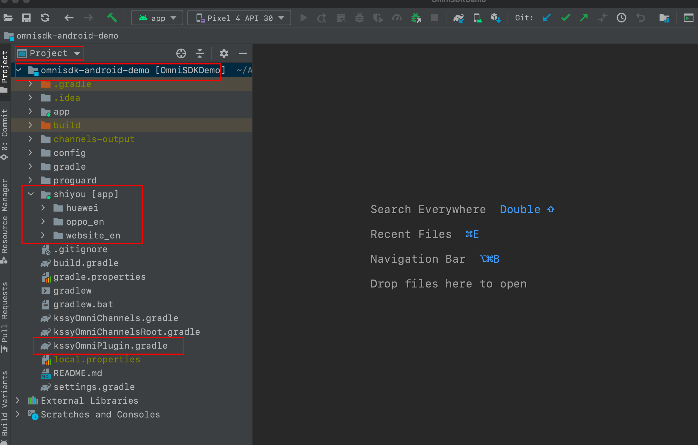
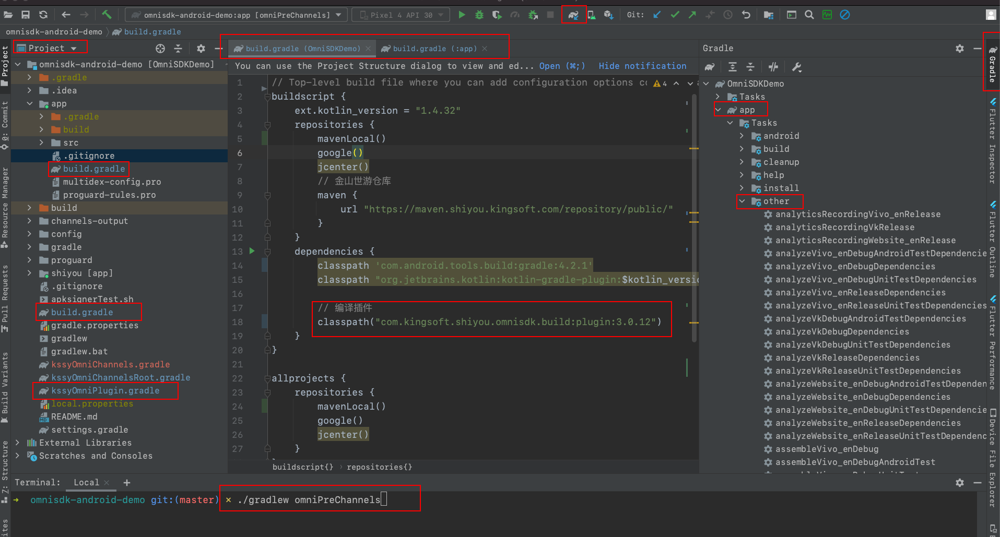
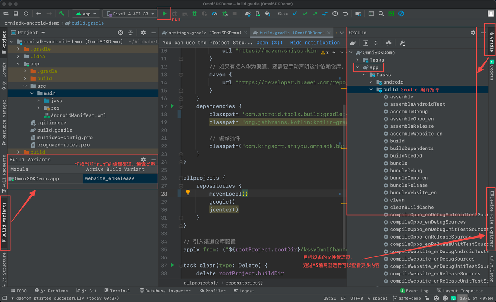
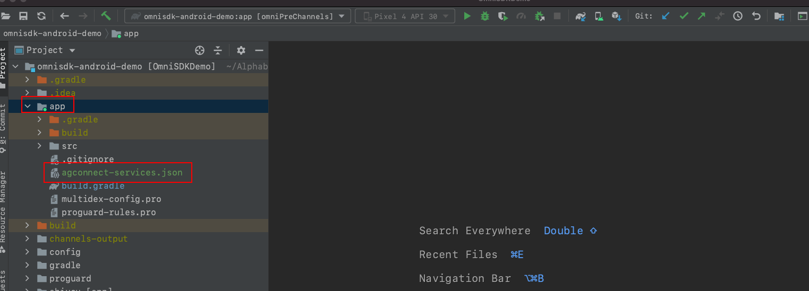

[<<返回首页](/sdk-docs)

OmniSDK Android 接入指南
====

<!-- TOC -->

- [简介](#简介)
- [SDK获取](#sdk获取)
- [版本记录](#版本记录)
- [对接须知](#对接须知)
- [集成配置](#集成配置)
    - [1. 拷贝Gradle文件和集成参数配置文件](#1-拷贝gradle文件和集成参数配置文件)
    - [2. 配置 `KSSYOmniPlugin` 编译插件](#2-配置-kssyomniplugin-编译插件)
    - [3. 初始化](#3-初始化)
        - [3.1 Application（必接）](#31-application必接)
        - [3.2 Activity生命周期方法接入 (必接)](#32-activity生命周期方法接入-必接)
- [API接口说明](#api接口说明)
    - [1. 账号](#1-账号)
    - [2. 支付](#2-支付)
    - [3. 社交](#3-社交)
    - [4. 特定功能](#4-特定功能)
    - [5. 数据统计](#5-数据统计)
        - [5.1 创建角色](#51-创建角色)
        - [5.2 角色升级](#52-角色升级)
        - [5.3 进入游戏](#53-进入游戏)
    - [6. 通用方法](#6-通用方法)
- [渠道编译](#渠道编译)
    - [渠道调试](#渠道调试)
    - [渠道编译配置工具](#渠道编译配置工具)
    - [手动编译配置说明](#手动编译配置说明)
- [渠道特殊说明](#渠道特殊说明)
    - [华为渠道](#华为渠道)
- [混淆配置](#混淆配置)
    - [OmniSDK 混淆配置](#omnisdk-混淆配置)
    - [第三方依赖库混淆配置说明](#第三方依赖库混淆配置说明)
    - [第三方依赖库混淆配置方法（建议）](#第三方依赖库混淆配置方法建议)
    - [开启混淆，保护代码安全](#开启混淆保护代码安全)
    - [开启混淆行号，方便调试定位](#开启混淆行号方便调试定位)
- [附录](#附录)
    - [Android 新手指南及 Javadoc 阅读](#android-新手指南及-Javadoc-阅读)
    - [SDK 常见状态码](#sdk-常见状态码)
    - [OmniSDK 业务集成与测试流程](#omnisdk-业务集成与测试流程)
    - [多语言](#多语言)
    - [版本最低兼容问题](#版本最低兼容问题)
    - [配置文件申请指南](#配置文件申请指南)

<!-- /TOC -->

# 简介
金山世游 OmniSDK Android 是一个聚合类型SDK，提供了账号，支付，广告，事件统计等功能模块。游戏完成一次对接后即可在各个应用商店平台和第三方发布渠道进行游戏发布。

# SDK获取

1. 请游戏项目联系我方负责人获取最新版本SDK。
2. 接入示例：[OmniSDK-Demo](https://github.com/kingsoftgames/omnisdk-android-demo/blob/master/app/src/main/java/com/kingsoft/shiyou/omnisdk/demo/ApiDemoShowDoc.kt)

# 版本记录

- :star2: **[版本历史记录](CHANGELOG.md)**
- :tada: 重要 `OmniSDK` 节点版本：[v1.0.8](CHANGELOG.md#version-108)
- :100: 渠道编译工具：[`KSSYOmniPlugin 3`](GradlePlugin.md)

# 对接须知

- :pushpin: 接入前，**请花十分钟时间阅读下本文档各章节**；:100: 推荐花两分钟阅读下 [Android 新手指南及 Javadoc 阅读](https://d7n9vj8ces.feishu.cn/docs/doccn2XLPh8odaiQDipvzBOcCzf)。
- 推荐使用 [Android Studio](https://developer.android.com/studio) 最新版本对接SDK，目前未对其他编译器做兼容测试。
- :pushpin: 检查游戏引用的 `Omni-API `包名路径***全部*** 为<font color=red> **`com.kingsoft.shiyou.omnisdk.api.*`** </font>。
- :round_pushpin: 如无特殊说明，**OmniSDK 本身不会申请任何权限**；权限一般由游戏或渠道SDK申请。
- OmniSDK 最低兼容版本为 `Android 5.0(API Level 21)`，阅读 [版本最低兼容问题](#版本最低兼容问题)。

    ```groovy
    android {
        compileSdkVersion 30 // 建议与 targetSdkVersion 相同
        // buildToolsVersion "30.0.3" // 无如必要，不需要指定此版本号
    
        defaultConfig {
            minSdkVersion 21
            targetSdkVersion 30 // 建议
        }
    }
    ```

# 集成配置

> :bookmark: **集成前，请花两分钟阅读文档:  [`OmniSDK KSSYOmniPlugin 3` 渠道编译工具](GradlePlugin.md)** 。

## 1. 拷贝Gradle文件和集成参数配置文件

- 将SDK ZIP解压后的 **<font color=red>`shiyou`文件夹</font>**、**<font color=red>`kssyOmniPlugin.gradle`</font>** 文件拷贝到游戏工程根目录下。
  
    

## 2. 配置 `KSSYOmniPlugin` 编译插件

- 在游戏项目工程(root-level)根目录下的 ***build.gradle*** ，添加如下配置:

    ```groovy
    buildscript {
        repositories {
            ...
            // 金山世游仓库
            maven {
                url "https://maven.shiyou.kingsoft.com/repository/public/"
            }
            // 如果有接入华为渠道，还需要手动声明这个依赖仓库，本配置不影响其他渠道。
            maven {
                url "https://developer.huawei.com/repo/"
            }
        }
        dependencies {
            // 建议使用游戏引擎提供的最新版本。
            classpath "com.android.tools.build:gradle:${your_version}"
            // 编译插件
            classpath "com.kingsoft.shiyou.omnisdk.build:plugin:3.0.13" // replace latest-version
        }
    }
    ```
    
- 在游戏应用模块(app-level)根目录下的 ***build.gradle*** ，添加如下配置:

    ```groovy
    apply from: ("${rootProject.rootDir}/kssyOmniPlugin.gradle") // 编译插件，必须在(app-level)级别添加
    
    android {
        defaultConfig {
            // applicationId "游戏包名" // 本行删除，不要自己配置，编译脚本会自动读取 project_config.json#package_name。
            // 包名必须 project_config.json#package_name、世游后台、相关第三方后台，保持一致，改动时需要一起改动。
            // multiDexEnabled = true  // 64k 方法数，如出现分包问题打开
        }
        // 使用Java8
        compileOptions {
            sourceCompatibility JavaVersion.VERSION_1_8
            targetCompatibility JavaVersion.VERSION_1_8
        }
        signingConfigs {
            // 签名配置，为保证安全，密钥密码不要明文配置在这里，而且通过文件读取方式配置。比如 store.properties
            release {
                try {
                    storeFile file("${rootProject.rootDir}/your-storeFile")
                    storePassword "your-store-password"
                    keyAlias "your-alias"
                    keyPassword "your-alias-password"
                } catch (ex) {
                    throw new InvalidUserDataException(ex.toString())
                }
            }
        }
    
        buildTypes {
            release {
                minifyEnabled true // 开启代码混淆：保护代码、减少包大小 （阅读[混淆配置]章节）
                multiDexKeepProguard = file("multidex-config.pro") // 分包配置
                proguardFiles getDefaultProguardFile('proguard-android-optimize.txt'), 'proguard-rules.pro'
                signingConfig signingConfigs.release // release包签名
            }
        }
    
        dependencies {
          // implementation("androidx.multidex:multidex:2.0.1") // 64k 方法数，如出现分包问题打开
        }
    }
    ```
  
- `Sync Gradle`，即点击`Sync Now` 或 Android Studio 菜单栏的“大象”图标，进行依赖同步。

- 同步成功后，命令行执行 **`gradlew omniPreChannels`** 或 Android Studio 右侧面板 `Gradle` 找到 `app/Tasks/other/omniPreChannels` 点击执行，如图示：

     

- 命令执行成功后，会自动在工程根目录生成两个文件 `kssyOmniChannels.gradle` 和 `kssyOmniChannelsRoot.gradle` :
  
    - 在游戏项目工程(root-level)根目录下的 ***build.gradle***，添加如下配置:
    
        ```groovy
        allprojects {
            ...
        }
        // 引入渠道仓库配置
        apply from: ("${rootProject.rootDir}/kssyOmniChannelsRoot.gradle")
        ```
        
    - 在游戏应用模块(app-level)根目录下的 ***build.gradle*** ，添加如下配置:
    
        ```groovy
        apply from: ("${rootProject.rootDir}/kssyOmniPlugin.gradle") // 编译插件，必须在(app-level)级别添加
        
        apply from: ("${rootProject.rootDir}/kssyOmniChannels.gradle") // 导入相关依赖，必须在(app-level)级别添加
        
        android {
            
        }
        ```
    
- 再次 `Sync Gradle`。依赖同步成功后即可以往下正式开发。

- :pushpin: 注意事件提醒：

    - `shiyou`文件夹内的所有新增、修改后，需执行 `omniPreChannels` 以生成最新渠道依赖配置。
    - 升级 KSSYOmniPlugin 后，执行 `omniPreChannels` 以生成最新渠道依赖配置。
    - 将上述集成的文件、修改，提交代码库。
    - 渠道编译、调试，请跳转阅读文档：[`OmniSDK KSSYOmniPlugin 3` 渠道编译工具](GradlePlugin.md)

## 3. 初始化
### 3.1 Application（必接）
* 为兼容部分渠道配置，统一添加以下配置:
    ```xml
    <application
            tools:replace="android:theme,allowBackup">
    ```
* 三种方式接入 **`OmniApplication`** ，任选一种适合游戏的方式 :
    1. 若游戏应用无自定义的Application，则在游戏应用工程 ***AndroidManifest.xml*** 配置文件的 `<application>` 中声明如下 `android:name` 的值:

        ```xml
        <application
            android:name="com.kingsoft.shiyou.omnisdk.project.OmniApplication"
            //...
        />
        ```

    2. 若游戏应用已经有自身定义的Application并继承自android.app.Application，则请将继承类改为 `OmniApplication` 即可,如下所示:

        ```java
        import com.kingsoft.shiyou.omnisdk.project.OmniApplication;
        
        public class GameApplication extends OmniApplication {
            //...
        }   
        ```
    
    3. 若游戏应用已经有自身定义的Application并继承其他的android.app.Application子类，则需要在其自定义Application的相应方法中添加如下代码:

        ```java
        @Override
        public void attachBaseContext(Context context) {
            super.attachBaseContext(context);
            MultiDex.install(context); // 64k方法数
            OmniSDK.getInstance().onApplicationAttachBaseContext(base)
            // your code goes here
        }
        
        @Override
        public void onCreate() {
            super.onCreate();
            OmniSDK.getInstance().onApplicationCreate(this);
            // your code goes here
        }
        
        @Override
        public void onLowMemory() {
            super.onLowMemory();
            OmniSDK.getInstance().onApplicationLowMemory();
            // your code goes here
        }
        
        @Override
        public void onTrimMemory(int level) {
            super.onTrimMemory(level);
            OmniSDK.getInstance().onApplicationTrimMemory();
            // your code goes here
        }
        
        @Override
        public void onTerminate() {
            super.onTerminate();
            OmniSDK.getInstance().onApplicationTerminate();
            // your code goes here
        }
        ```

### 3.2 Activity生命周期方法接入 (必接)
* 请在游戏 **自身Activity** 的相应生命周期方法中添加如下代码:

    ```java
    @Override
    public void onCreate(Bundle savedInstanceState) {
        super.onCreate(savedInstanceState);
        OmniSDK.getInstance().onCreate(this, savedInstanceState);
        // your code goes here
    }
    
    @Override
    public void onStart() {
        super.onStart();
        OmniSDK.getInstance().onStart(this);
        // your code goes here
    }
    
    @Override
    public void onRestart() {
        super.onRestart();
        OmniSDK.getInstance().onRestart(this);
        // your code goes here
    }
    
    @Override
    public void onResume() {
        super.onResume();
        OmniSDK.getInstance().onResume(this);
        // your code goes here
    }
    
    @Override
    public void onPause() {
        super.onPause();
        OmniSDK.getInstance().onPause(this);
        // your code goes here
    }
    
    @Override
    public void onStop() {
        super.onStop();
        OmniSDK.getInstance().onStop(this);
        // your code goes here
    }
    
    @Override
    public void onDestroy() {
        super.onDestroy();
        OmniSDK.getInstance().onDestroy(this);
        // your code goes here
    }
    
    @Override
    public void onNewIntent(Intent intent) {
        super.onNewIntent(intent);
        OmniSDK.getInstance().onNewIntent(this, intent);
        // your code goes here
    }
    
    @Override
    public void onSaveInstanceState(Bundle outState) {
        super.onSaveInstanceState(outState);
        OmniSDK.getInstance().onSaveInstanceState(this, outState);
        // your code goes here
    }
    
    @Override
    public void onRestoreInstanceState(Bundle savedInstanceState) {
        super.onRestoreInstanceState(savedInstanceState);
        OmniSDK.getInstance().onRestoreInstanceState(this, savedInstanceState);
        // your code goes here
    }
    
    @Override
    public void onConfigurationChanged(Configuration newConfig) {
        super.onConfigurationChanged(newConfig);
        OmniSDK.getInstance().onConfigurationChanged(this, newConfig);
        // your code goes here
    }
    
    @Override
    public void onActivityResult(
            int requestCode,
            int resultCode,
            Intent data) {
        super.onActivityResult(requestCode, resultCode, data);
        OmniSDK.getInstance().onActivityResult(
                this,
                requestCode,
                resultCode,
                data);
        // your code goes here
    }
    
    @Override
    public void onRequestPermissionsResult(
            int requestCode,
            String[] permissions,
            int[] grantResults) {
        super.onRequestPermissionsResult(requestCode, permissions, grantResults);
        OmniSDK.getInstance().onRequestPermissionsResult(
                this, requestCode,
                permissions,
                grantResults);
        // your code goes here
    }
    
    @Override
    public void onBackPressed() {
        super.onBackPressed();
        OmniSDK.getInstance().onBackPressed(this);
        // your code goes here
    }
    
    @Override
    public boolean onKeyDown(int keyCode, KeyEvent event) {
        if (OmniSDK.getInstance().onKeyDown(this, keyCode, event)) {
            return true;
        }
        // your code goes here
        return super.onKeyDown(keyCode, event);
    }
    ```

# API接口说明
- :pushpin: **OmniSDK 接口对线程调用无要求，游戏调用接口时无需开启新线程。**
- 默认回调时，无需额外切换线程；如要在主线程处理一些UI事件，则需游戏自己切换到主线程，比如可以使用`runOnUiThread`。
- :bookmark: 游戏按自身需求集成所需API；保持API最大公约数，一次接入多渠道编译。
- **全部接口：API接口文档 - [`OmniSDK`][OmniSDK_API]**

## 1. 账号
- API接口文档 - [`IAccount`][IAccount]
- 重要提示 :speaker:
  >接入的账号类型包含游客类型，**绑定账号**接口最好必接；
  >
  >游戏引导玩家主动绑定账号，防止帐号数据丢失。

## 2. 支付
- API接口文档 - [`IPay`][IPay]
- 重要提示 :speaker:
  >如果要接支付，必须接[账号](#1-账号)；
  >
  >如果游戏无账号功能，先调用`OmniSDK`提供的游客类型账号接口，进行静默注册登录后，再进行后续支付等操作。

## 3. 社交
- 可选
- API接口文档 - [`ISocial`][ISocial]
- 重要提示 :speaker:
  >社交信息获取需要使用对应账号类型登录；
  >
  >比如需要`Facebook`好友信息，需要用`Facebook`进行登录，则要接[账号](#1-账号)。

## 4. 特定功能
- 可选
- API接口文档 - [`IAction`][IAction]

## 5. 数据统计
- API接口文档 - [`IDataMonitor`][IDataMonitor]
- ***接入提示***
  1. 如果游戏没有角色这一特征，可以不用接入。
  2. 目前暂没有渠道强制要求接入，可以不用接入。

## 6. 通用方法
- 可选
- API接口文档 - [`IMethod`][IMethod]

# 渠道编译

## 渠道调试
- Android Studio 左侧面板 `Build Variants` 切换当前渠道，然后直接 `Run` 安装。

    
    
## 渠道编译配置工具
详情参考：[`KSSYOmniPlugin 3`](GradlePlugin.md)

## 手动编译配置说明
详情参考：[手动编译配置](编译配置.md)

# 渠道特殊说明

## 华为渠道
- 有华为渠道时，需要(root-level)根目录下的 ***build.gradle***，添加如下配置，参考[2. 配置 `KSSYOmniPlugin` 编译插件](#2-配置-kssyomniplugin-编译插件):
  
  ```groovy
   buildscript {
       repositories {
           // 如果有接入华为渠道，还需要手动声明这个依赖仓库，本配置不影响其他渠道。
           maven {
               url "https://developer.huawei.com/repo/"
           }
       }
   }
  ```
  
- 华为渠道，需要在(app-level)根目录，添加 agconnect-services.json 文件（本文件由项目方的商务或运营提供）；项目直接添加，可与其他渠道共存，不影响相互编译、功能。
  
    

# 混淆配置
## OmniSDK 混淆配置
- OmniSDK 混淆配置集成在自身依赖包内，编译时自动配置，游戏对此无需额外配置。
- 64k 方法数分包需要游戏自身配置，参考`multidex-config.pro` [下载](./proguard/multidex-config.pro)

## 第三方依赖库混淆配置说明
第三方依赖库混淆配置，防止配置冲突，需要由游戏应用配置，目前用到的如下：
- Gson [必选-下载](./proguard/gson-rules.pro)，[v1.0.8](CHANGELOG.md#version-108) 及以上已内部集成 Gson 混淆，游戏无需额外集成。

## 第三方依赖库混淆配置方法（建议）
- 在游戏应用工程建立文件夹`proguard`。
- 将相应的第三方依赖库混淆配置各按独立文件存放，比如`gson-rules.pro`。
- 在游戏应用模块(app-level)根目录下的 ***build.gradle*** ，增加如下配置: 

    ```groovy
    android {
        buildTypes {
            release {
                // 增加独立文件混淆配置
                proguardFiles file("${rootProject.rootDir}/proguard").listFiles().toList().toArray()
            }
        }
    }
    ```

## 开启混淆，保护代码安全
- (app-level) ***build.gradle***
    ```groovy
    android {
        buildTypes {
            release {
                minifyEnabled true // 开启代码混淆：保护代码、减少包大小 （阅读[混淆配置]章节）
                // shrinkResources false // 此功能会移除 RId 未被引用的资源，不要开启，否则SDK部分资源会被删除导致功能无法使用。
                multiDexKeepProguard = file("multidex-config.pro") // 分包配置
                proguardFiles getDefaultProguardFile('proguard-android-optimize.txt'), 'proguard-rules.pro'
                signingConfig signingConfigs.release // release包签名
            }
        }
    }
    ```

## 开启混淆行号，方便调试定位
- 编译时，开启(app-level) ***proguard-rules.pro*** 行号配置，方便准确定位问题代码。

    ```text
    # Uncomment this to preserve the line number information for
    # debugging stack traces.
    -keepattributes SourceFile,LineNumberTable
    
    # If you keep the line number information, uncomment this to
    # hide the original source file name.
    -renamesourcefileattribute SourceFile
    ```

# 附录
## Android 新手指南及 Javadoc 阅读

> v1.0.8 开始，使用 Android Studio 编译器，可以直接在[代码上查看API文档](https://d7n9vj8ces.feishu.cn/docs/doccn2XLPh8odaiQDipvzBOcCzf#pjSuFB)。

1. [Android 新手指南](https://d7n9vj8ces.feishu.cn/docs/doccn2XLPh8odaiQDipvzBOcCzf#)，建议接入人员花两分钟看下。
2. 如何查看接口、方法、参数的具体说明、数据、返回值等：[Javadoc 方法页面说明](https://d7n9vj8ces.feishu.cn/docs/doccn2XLPh8odaiQDipvzBOcCzf#cCpjVr)
3. ***Since 标识***：版本号，当前接口开始支持或变更信息。

## SDK 常见状态码
详情阅读 [状态码](OmniStatusCodes.md)

## OmniSDK 业务集成与测试流程
- [渠道测试、兼容性事项](https://d7n9vj8ces.feishu.cn/sheets/shtcnxUgMM7YhIPcIgA2Hb7BFMh?sheet=0kQlJx)
- 建议使用 [渠道测试反馈处理模板](https://d7n9vj8ces.feishu.cn/sheets/shtcnxUgMM7YhIPcIgA2Hb7BFMh?sheet=CUL9pM) 进行问题反馈跟踪处理。
- [OmniSDK 业务流程事项](OmniSDK业务流程.md)
- 本文档持续更新中，会将Omni、项目遇到的公共问题记录。建议每次测试、特别是测试渠道前查看。
- 欢迎各项目组一起完善此测试文档。

## 多语言
如果游戏需要自己更改或适配多语言文案，请参考 [OmniSDK 多言语更改、适配](https://d7n9vj8ces.feishu.cn/docs/doccndfkHa0s8VCeQk231J9dlSb#pRBX4A)

## 版本最低兼容问题
SGSDK(不再升级维护) 目前部分渠道还支持Android 4.4(API Level 19)，但是 OmniSDK 对 Android 5.0(API Level 21) 以下将不再支持。

原因有以下几个：
1. Google 统计  Android 5.0以下的占有率已经非常低，不到 1%。
2. 国内重要渠道如小米、华为、应用宝等，都要求 API Level 24 以上。
3. 网络库OkHttp，最低支持API Level 21，并且从 Android 5.0开始成为系统网络库组成；OmniSDK 及很多第三方库的高版本都在引用，如果不使用第三方SDK的高版本，比如 Facebook，有些功能可能会逐步无法使用、一些`API`被限制或废弃。
4. 一些第三方SDK、渠道SDK，最新版本都做了一些最低版本兼容要求；特别是渠道SDK，会强制要求更新。
5. 审核问题，比如 TLS 1.2问题，GooglePlay 2020-12-16已经禁止上线；如果不随审核升级而升级相应SDK新版本，渠道审核可能就无法通过。

## 配置文件申请指南
- [Google-Facebook 参数获取说明](google_help.md)。
- 与管理员、产品确认需要申请的参数，参考[配置文件申请指南](https://d7n9vj8ces.feishu.cn/docs/doccn5apz08CeDpLCDTtshsSKmd)，在后台填写参数。
- 完成后通知 Omni 出包验证，参数无误，会发送所有的文件。


[OmniSDK_API]:./api/html/-omni-s-d-k/com.kingsoft.shiyou.omnisdk.api/-omni-s-d-k/index.html
[IAccount]:./api/html/-omni-s-d-k/com.kingsoft.shiyou.omnisdk.api.interfaces/-i-account/index.html
[IPay]:./api/html/-omni-s-d-k/com.kingsoft.shiyou.omnisdk.api.interfaces/-i-pay/index.html
[ISocial]:./api/html/-omni-s-d-k/com.kingsoft.shiyou.omnisdk.api.interfaces/-i-social/index.html
[IAction]:./api/html/-omni-s-d-k/com.kingsoft.shiyou.omnisdk.api.interfaces/-i-action/index.html
[IDataMonitor]:./api/html/-omni-s-d-k/com.kingsoft.shiyou.omnisdk.api.interfaces/-i-data-monitor/index.html
[IMethod]:./api/html/-omni-s-d-k/com.kingsoft.shiyou.omnisdk.api.interfaces/-i-method/index.html
[RoleInfo]:./api/html/-omni-s-d-k/com.kingsoft.shiyou.omnisdk.api.entity/-role-info/index.html

[emoji]:https://www.webfx.com/tools/emoji-cheat-sheet/
[集成与测试要点]:https://d7n9vj8ces.feishu.cn/mindnotes/bmncnEiMKr172vpNu83YrC108ne#mindmap