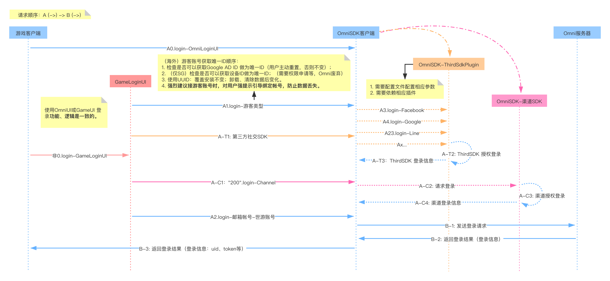
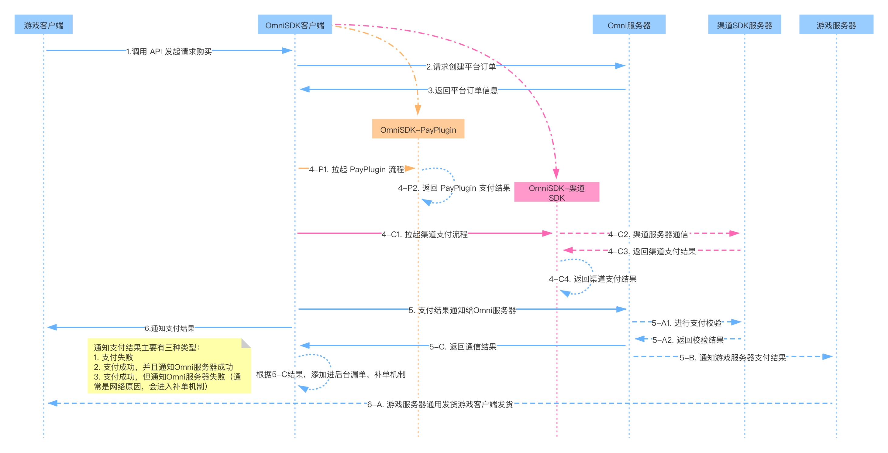

[<<返回首页](/sdk-docs)

OmniSDK业务流程
====
<!-- TOC -->

- [登录](#登录)
    - [业务流程](#业务流程)
    - [注意](#注意)
- [支付](#支付)
    - [业务流程](#业务流程-1)
    - [注意](#注意-1)
- [FAQ](#faq)

<!-- /TOC -->

# 登录

## 业务流程

## 注意
1. 测试前要保证登录类型的参数一致：配置文件参数、Omni后台配置、相应第三方后台配置一致；特别是**签名文件与包名**。
2. 游客类型，强烈建议对用户进行强引导绑定，防止账号数据丢失。
3. 第三方登录，比如 Facebook，需要配置文件配置相应参数、依赖相应插件。
4. 其他参考：[接入文档](./OmniSDKAndroid接入文档.md)、[集成与测试要点][集成与测试要点]。

# 支付

## 业务流程

## 注意
1. 测试前要保证登录类型的参数一致：配置文件参数、Omni后台配置、相应第三方后台配置一致；特别是**签名文件与包名**。
2. 海外发行区，一般不要使用中国区账号测试。
3. 测试支付前确认测试地区是否签约、已开通支付功能。
4. 测试支付时保证，**VPN、账号等是发行区支持的**，否则根据渠道政策通常是失败的。
5. 其他参考：[接入文档](./OmniSDKAndroid接入文档.md)、[集成与测试要点][集成与测试要点]。

# FAQ
- [集成与测试要点][集成与测试要点]。
- 本文档持续更新中，会将Omni、项目遇到的公共问题记录。建议每次测试、特别是测试渠道前查看。
- 欢迎各项目组一起完善此测试文档。

[原始文件 OmniSDK业务流程.pos：processon-新建-导入]:https://www.processon.com/diagrams
[集成与测试要点]:https://d7n9vj8ces.feishu.cn/mindnotes/bmncnEiMKr172vpNu83YrC108ne#mindmap

