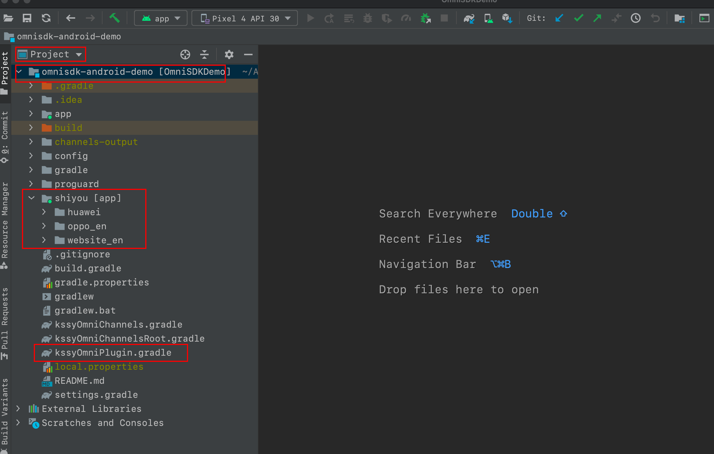

[<<返回首页](/sdk-docs)

OmniSDK Android 接入指南
=====

<!-- TOC -->

- [简介](#简介)
- [OmniSDK获取](#omnisdk获取)
- [术语](#术语)
- [环境与代码](#环境与代码)
    - [编译环境](#编译环境)
    - [代码建议](#代码建议)
    - [Android 知识快速指南](#android-知识快速指南)
- [集成与开发](#集成与开发)
    - [集成须知](#集成须知)
    - [开始集成](#开始集成)
    - [开始开发](#开始开发)
        - [1. Application 接入（必接）](#1-application-接入必接)
        - [2. GameActivity 接入（必接）](#2-gameactivity-接入必接)
        - [3. API 开发](#3-api-开发)
            - [3.1 API 接口说明](#31-api-接口说明)
            - [3.2 功能逻辑处理说明](#32-功能逻辑处理说明)
            - [3.3 功能接口列表](#33-功能接口列表)
                - [3.3.1. 账号](#331-账号)
                - [3.3.2. 支付](#332-支付)
                - [3.3.3. 社交](#333-社交)
                - [3.3.4. 常用功能](#334-常用功能)
                - [3.3.5. 渠道特定方法](#335-渠道特定方法)
                - [3.3.6. 数据统计](#336-数据统计)
        - [4. API 文档](#4-api-文档)
- [混淆配置](#混淆配置)
    - [混淆说明](#混淆说明)
    - [开启行号](#开启行号)
    - [游戏运行时混淆问题](#游戏运行时混淆问题)
- [编译与出包](#编译与出包)
    - [通用编译与CPS标签包](#通用编译与cps标签包)
    - [部分渠道特殊配置](#部分渠道特殊配置)
    - [高级扩展](#高级扩展)
- [常见问题](#常见问题)
- [附录](#附录)
    - [版本记录](#版本记录)
    - [状态码与多语言扩展](#状态码与多语言扩展)
    - [Android 知识快速指南](#android-知识快速指南-1)

<!-- /TOC -->

# 简介
金山世游 OmniSDK Android 是一个聚合类型SDK，提供了账号，支付，广告，事件统计等功能模块。游戏完成一次对接后即可在各个应用商店或渠道平台进行游戏发布。

# OmniSDK获取

请游戏项目根据 [OmniSDK 接入流程参考](https://d7n9vj8ces.feishu.cn/docs/doccnwk3PJDBIKOTaZdSPNmNTGg) 做好前期参数等事项，联系我方负责人获取最新版本SDK。

# 术语

- **JDK**：Java Development Kit Java开发工具包。
- **ADT**：Android Development Tools，Android 开发套件，[Android Studio][Android Studio] 默认集成，其他 IDE 需要手动集成。
- [Android Studio][Android Studio]：Android 官方 IDE工具，内部集成完整的 Android 编译环境。
- **root-leve**l：项目根目录。
- **app-level**：主工程目录（通常命名为app），即 GameActivity 所在的目录。
- **libs-level**：libs 级别的工程目录。
- **GameActivity**：游戏主Activity，继承 `android.app.NativeActivity` 或 `com.google.androidgamesdk.GameActivity`。（通常是这个命名，具体以引擎命名为主）

# 环境与代码

## 编译环境

1. Android 开发、编译环境依赖 JDK（11）、ADT、Gradle Tools，请根据游戏引擎的“移动平台或Android（安卓）游戏开发”相关章节，配置好相关环境。
2. Android 开发，支持任意支持 Java 进行 Android 开发的 IDE工具：[Android Studio][Android Studio]、IDEA、VS Code等，只需要配置相关环境。
3. OmniSDK 编译指令（或说Android编译指令）不依赖IDE工具，可以直接通过命令行执行。
4. **Android 12 开始 Android 官方最新依赖库开始要求 JDK（11）**。
    - 从【Android Studio】 Settings > Build, Execution, Deployment > Build Tools > Gradle > Gradle JDK：查看工程当前使用的 Java 版本号。
    - 通过命令行 `java -version` 查看电脑的 Java 版本号。

## 代码建议

1. 建议游戏项目直接在 **app-level** 开发，不要新建 Module（**libs-level**）来接入，有些编译功能目前不支持。
2. 根据调研，主流的引擎都可以导出可编译的Android工程结构，通常在“移动平台或Android（安卓）游戏开发”相关的“Android调试”类似章节有说明。
3. 建议使用 **Android Studio** 进行 Java 代码接口的接入，主要原因是接口有实时代码、文档提示，实时编译、调试功能，可及时发现问题。

## Android 知识快速指南

[Android 知识快速指南及 Javadoc 阅读](https://d7n9vj8ces.feishu.cn/docs/doccn2XLPh8odaiQDipvzBOcCzf)。

# 集成与开发

## 集成须知

1. 如无特殊说明，**OmniSDK 本身不会申请任何权限**，权限一般由游戏或渠道SDK申请。
2. OmniSDK 最低兼容版本为 `Android 5.0(API Level 21)`。
3. **接入前确保科学上网正常，依赖同步时需要访问 Google服务器**。
4. 如游戏引擎无特殊要求，请按下面OmniSDK验证过的集成环境配置。

## 开始集成

1. 将 **<font color=red>shiyou 文件夹</font>**、**<font color=red>kssyOmniPlugin.gradle</font>** 文件拷贝到游戏工程根目录下。

    

2. 在 **root-level** 下的 ***build.gradle*** ，添加如下配置:

    ```groovy
    buildscript {
        repositories {
            // OmniSDK 仓库
            maven {
                url "https://maven.shiyou.kingsoft.com/repository/public/"
            }
            // 如果有接入华为渠道，还需要手动声明这个依赖仓库，本配置不影响其他渠道。
            maven {
                url "https://developer.huawei.com/repo/"
            }
            // 其他特殊渠道配置（如果有接入）
        }
        
        dependencies {
            classpath "com.android.tools.build:gradle:4.2.1" // 建议版本｜游戏引擎提供的最新高版本
            // OmniSDK 编译插件
            classpath "com.kingsoft.shiyou.omnisdk.build:plugin:3.1.2" // replace latest-version
        }
    }

    // file: gradle/wrapper/gradle-wrapper.properties > distributionUrl=https\://services.gradle.org/distributions/gradle-6.7.1-all.zip
    ```

3. 在 **app-level** 下的 ***build.gradle*** ，添加如下配置:

    ```groovy
    apply from: ("${rootProject.rootDir}/kssyOmniPlugin.gradle") // OmniSDK 编译插件，必须在(app-level)级别添加
    
    // 读取密钥
    def signingP = new Properties()
    signingP.load(new FileInputStream(file(rootProject.file("signing.properties"))))
   
    android {
        compileSdkVersion 31 // 与 targetSdkVersion 相同
        // buildToolsVersion "31.0.0" // 无如必要，不需要指定此版本号，保持最新即可
    
        defaultConfig {
            // applicationId "游戏包名" // 本行删除，不要自己配置，编译脚本会自动读取 project_config.json#package_name。
            // 包名必须 project_config.json#package_name、OmniSDK后台、相关第三方SDK后台，保持一致；
            // 变更包名时需要同步所有地方的包名及相应参数。
            minSdkVersion 21 // 最低兼容API，Android 5.0
            targetSdkVersion 31 // Android 12
        }
        
        // 开启Java8
        compileOptions {
            sourceCompatibility JavaVersion.VERSION_1_8
            targetCompatibility JavaVersion.VERSION_1_8
        }
        
        signingConfigs {
            // 签名配置，为保证安全，密钥密码不要明文配置在这里，而是通过文件读取方式配置。比如 signing.properties
            release {
                storeFile file("${your-path}/signing.properties")
                storePassword signingP["storePassword"]
                keyAlias signingP["keyAlias"]
                keyPassword signingP["keyPassword"]
            }
        }
    
        buildTypes {
            release {
                minifyEnabled true // 开启代码混淆：保护代码、减少包大小
                // multiDexKeepProguard = file("multidex-config.pro") // 分包配置，如果需要
                proguardFiles getDefaultProguardFile('proguard-android-optimize.txt'), 'proguard-rules.pro'
                signingConfig signingConfigs.release // release包签名
            }
        }
    
        dependencies {
          // your other deps
        }
    }
    ```

4. 点击IDE **`Sync Project with Gradle Files`** 按钮，进行依赖同步与初始化。
    - 或 **File > Sync Project with Gradle Files**。
    - 或 **Tools > Android > Sync Project with Gradle Files**。
    - 命令行同步指令已被Gradle官方删除，可以执行 `gradlew aDebug` 代替。

5. 同步成功后，命令行执行 **`gradlew omniPreChannels`**，会自动在 **root-level** 目录生成两个文件 ***kssyOmniChannels.gradle*** 和 ***kssyOmniChannelsRoot.gradle***
    - 在 **root-level** 下的 ***build.gradle***，添加如下配置:
    
        ```groovy
        ... 
        allprojects {
            ...
        }
        // 引入渠道仓库配置
        apply from: ("${rootProject.rootDir}/kssyOmniChannelsRoot.gradle")
        ```
        
    - 在 **app-level** 下的 ***build.gradle*** ，添加如下配置:
    
        ```groovy
        apply from: ("${rootProject.rootDir}/kssyOmniPlugin.gradle") // 编译插件，必须在(app-level)级别添加
        
        apply from: ("${rootProject.rootDir}/kssyOmniChannels.gradle") // 导入相关依赖，必须在(app-level)级别添加，暂时不支持lib形式
        
        android {
            ...
        }
        ```

5. 重复执行步骤【4】的同步操作，同步完成后即可往下开发。

## 开始开发

### 1. Application 接入（必接）
- 为兼容部分渠道配置，统一添加以下配置:
    ```xml
    <application
            tools:replace="android:theme,allowBackup">
    ```
- OmniSDK 支持以下方式接入 **OmniApplication**，游戏任选适合的一种:
    1. 若游戏无自定义的 Application，可直接在 **app-level** 下的 ***AndroidManifest.xml*** 声明如下:

        ```xml
        <application
            android:name="com.kingsoft.shiyou.omnisdk.project.OmniApplication"
        />
        ```

    2. 若游戏有自定义的 Application，并且继承自 android.app.Application，可将继承改为 **OmniApplication**，如下:

        ```java
        import com.kingsoft.shiyou.omnisdk.project.OmniApplication;
        
        public class GameApplication extends OmniApplication {
        }   
        ```
    
    3. 若游戏有自定义的 Application，并且继承其他 SDK 的 Application 子类，则在自定义 Application 的方法中添加如下代码:

        ```java
        @Override
        public void attachBaseContext(Context context) {
            super.attachBaseContext(context);
            MultiDex.install(context); // 64k方法数
            OmniSDK.getInstance().onApplicationAttachBaseContext(context)
        }
        
        @Override
        public void onCreate() {
            super.onCreate();
            OmniSDK.getInstance().onApplicationCreate(this);
        }
        
        @Override
        public void onLowMemory() {
            super.onLowMemory();
            OmniSDK.getInstance().onApplicationLowMemory();
        }
        
        @Override
        public void onTrimMemory(int level) {
            super.onTrimMemory(level);
            OmniSDK.getInstance().onApplicationTrimMemory();
        }
        
        @Override
        public void onTerminate() {
            super.onTerminate();
            OmniSDK.getInstance().onApplicationTerminate();
        }
        ```

### 2. GameActivity 接入（必接）

- 游戏可以直接用写好的 [YourGameActivity.java](./res/YourGameActivity.java) 替换 NativeActivity 做继承，再在 YourGameActivity 实现相关逻辑。
    ```java
    // 原：public class GameActivity extends NativeActivity implements ** {
    public class GameActivity extends YourGameActivity implements ** {
       ... 
    }
    ```
- 或在 **GameActivity** 添加下面 OmniSDK 的生命周期等方法:

    ```java
    @Override
    protected void onCreate(Bundle savedInstanceState) {
        super.onCreate(savedInstanceState);
        OmniSDK.getInstance().onCreate(this, savedInstanceState);
    }
    
    @Override
    public void onStart() {
        super.onStart();
        OmniSDK.getInstance().onStart(this);
    }
    
    @Override
    public void onRestart() {
        super.onRestart();
        OmniSDK.getInstance().onRestart(this);
    }
    
    @Override
    public void onResume() {
        super.onResume();
        OmniSDK.getInstance().onResume(this);
    }
    
    @Override
    public void onPause() {
        super.onPause();
        OmniSDK.getInstance().onPause(this);
    }
    
    @Override
    public void onStop() {
        super.onStop();
        OmniSDK.getInstance().onStop(this);
    }
    
    @Override
    public void onDestroy() {
        super.onDestroy();
        OmniSDK.getInstance().onDestroy(this);
    }
    
    @Override
    public void onNewIntent(Intent intent) {
        super.onNewIntent(intent);
        OmniSDK.getInstance().onNewIntent(this, intent);
    }
    
    @Override
    public void onSaveInstanceState(Bundle outState) {
        super.onSaveInstanceState(outState);
        OmniSDK.getInstance().onSaveInstanceState(this, outState);
    }
    
    @Override
    public void onRestoreInstanceState(Bundle savedInstanceState) {
        super.onRestoreInstanceState(savedInstanceState);
        OmniSDK.getInstance().onRestoreInstanceState(this, savedInstanceState);
    }
    
    @Override
    public void onConfigurationChanged(Configuration newConfig) {
        super.onConfigurationChanged(newConfig);
        OmniSDK.getInstance().onConfigurationChanged(this, newConfig);
    }
    
    @Override
    public void onActivityResult(
            int requestCode,
            int resultCode,
            Intent data) {
    
        super.onActivityResult(requestCode, resultCode, data);
        OmniSDK.getInstance().onActivityResult(
                this,
                requestCode,
                resultCode,
                data);  
    }
    
    @Override
    public void onRequestPermissionsResult(
            int requestCode,
            String[] permissions,
            int[] grantResults) {
        super.onRequestPermissionsResult(requestCode, permissions, grantResults);
        OmniSDK.getInstance().onRequestPermissionsResult(
                this, requestCode,
                permissions,
                grantResults);
    }
    
    @Override
    public void onBackPressed() {
        OmniSDK.getInstance().onBackPressed(this);
    }
    
    @Override
    public boolean onKeyDown(int keyCode, KeyEvent event) {
        if (OmniSDK.getInstance().onKeyDown(this, keyCode, event)) {
            return true;
        }
    
        // CP 自己的代码
    
        return super.onKeyDown(keyCode, event);
    }
    ```

### 3. API 开发
> 以上编译集成、初始化等步骤都完成后，就可以按项目需要的功能进行开发了。

#### 3.1 API 接口说明
- :pushpin: OmniSDK 接口对线程的调用无要求，游戏调用接口时无需开启新线程。
- 回调时，无需额外切换线程。
- 如处理一些 UI 事件，则需要确保在主线程执行：
    1. 使用 `runOnUiThread`。
        ```java
        runOnUiThread(new Runnable() {
            @Override
            public void run() {
                
            }
        });
        ```
    2. 使用 `Handler`
        ```java
        new Handler(Looper.getMainLooper()).post(new Runnable() {
            @Override
            public void run() {
                
            }
        });
        ```

#### 3.2 功能逻辑处理说明
- OmniSDK 秉持只接一次API接口的设计理念，在配合 `shiyou` 文件夹的多渠道配置后，可一次出多个渠道产物。
- OmniSDK 会提供一些识别性API，比如获取当前渠道名等，方便游戏自定义特定渠道或功能的逻辑，从而游戏不需要为特定功能或渠道拉取特定代码分支，减少代码维护成本。

#### 3.3 功能接口列表

##### 3.3.1. 账号
[OmniSDK 账号 API](./doc/IAccount.md)

##### 3.3.2. 支付
[OmniSDK 支付 API](./doc/IPay.md)

##### 3.3.3. 社交
[OmniSDK 社交 API](./doc/ISocial.md)

##### 3.3.4. 常用功能
- [x] 可选功能
- 提供一些常用的功能接口
- [IAction API Javadoc][IAction]

##### 3.3.5. 渠道特定方法
- [x] 可选功能
- 通过反射调用部分渠道的特定方法
- [IMethod API Javadoc][IMethod]

##### 3.3.6. 数据统计
[OmniSDK 数据统计 API](./doc/IDataMonitor.md)


### 4. API 文档

[OmniSDK API Javadoc][OmniSDK_API]

# 混淆配置
## 混淆说明
- OmniSDK 混淆配置集成在自身依赖包内，编译时自动配置，游戏对此无需额外配置。
- 64k 方法数分包需要游戏自身配置，如果需要参考`multidex-config.pro` [下载](./proguard/multidex-config.pro)

## 开启行号
- 编译时，开启 **app-level** 下的 ***`proguard-rules.pro`*** 行号配置，方便准确定位问题代码。

    ```text
    # Uncomment this to preserve the line number information for
    # debugging stack traces.
    -keepattributes SourceFile,LineNumberTable
    
    # If you keep the line number information, uncomment this to
    # hide the original source file name.
    -renamesourcefileattribute SourceFile
    ```

## 游戏运行时混淆问题
- 如果 Debug包 没有问题，Release包 编译无问题、但是运行时有问题，通常是混淆原因。
- 因各游戏引擎的编译脚本不同，如果 ADT 混淆机制在编译时没有生效，游戏可以下载 [game-rules.pro](./proguard/game-rules.pro)，并增加以下配置；
    ```groovy
    buildTypes {
        release {
            minifyEnabled true 
            proguardFiles getDefaultProguardFile("proguard-android-optimize.txt"), "proguard-rules.pro"
            proguardFiles file("game-rules.pro")
        }
    }
    ```
- 如果上述配置也无法生效，那就手动在 `proguardAdditions` 节点增加 [game-rules.pro](./proguard/game-rules.pro) 的内容。
    ```xml
    // 不同引擎可能节点名称不一样
    <proguardAdditions>
        <insert>
            "...game-rules.pro 内容..."
        <insert/>
    <proguardAdditions/>
    ```
- 注意 [game-rules.pro](./proguard/game-rules.pro) 只是部分混淆内容，游戏应该根据运行日志动态增减混淆内容，混淆规则[参考](https://github.com/henleylee/Proguard)。

# 编译与出包

## 通用编译与CPS标签包

[OmniSDK 通用编译与CPS标签包](./doc/GeneralCompilation.md)

## 部分渠道特殊配置

- 渠道接入必读
- [OmniSDK 部分渠道特殊配置](./doc/ChannelCompilation.md)

## 高级扩展
[OmniSDK 编译功能高级扩展](./doc/AdvancedCompilation.md)

# 常见问题
[OmniSDK FAQ 目录](https://d7n9vj8ces.feishu.cn/docs/doccnODVmrXNlF6aaISDRU0tJ7e)

# 附录

## 版本记录
[OmniSDK 版本记录](https://d7n9vj8ces.feishu.cn/docs/doccn9IsNVuJKFHQb1BqbxYHcdd)

## 状态码与多语言扩展
[OmniSDK 状态码与多语言扩展](https://d7n9vj8ces.feishu.cn/docs/doccndfkHa0s8VCeQk231J9dlSb)

## Android 知识快速指南
[Android 知识快速指南及 Javadoc 阅读](https://d7n9vj8ces.feishu.cn/docs/doccn2XLPh8odaiQDipvzBOcCzf)。


<!-- 文档 -->
[Android Studio]:https://developer.android.com/studio/intro?hl=zh-cn
[OmniSDK_API]:./api/html/-omni-s-d-k/com.kingsoft.shiyou.omnisdk.api/-omni-s-d-k/index.html
[IAccount]:./api/html/-omni-s-d-k/com.kingsoft.shiyou.omnisdk.api.interfaces/-i-account/index.html
[IPay]:./api/html/-omni-s-d-k/com.kingsoft.shiyou.omnisdk.api.interfaces/-i-pay/index.html
[ISocial]:./api/html/-omni-s-d-k/com.kingsoft.shiyou.omnisdk.api.interfaces/-i-social/index.html
[IAction]:./api/html/-omni-s-d-k/com.kingsoft.shiyou.omnisdk.api.interfaces/-i-action/index.html
[IDataMonitor]:./api/html/-omni-s-d-k/com.kingsoft.shiyou.omnisdk.api.interfaces/-i-data-monitor/index.html
[IMethod]:./api/html/-omni-s-d-k/com.kingsoft.shiyou.omnisdk.api.interfaces/-i-method/index.html
[RoleInfo]:./api/html/-omni-s-d-k/com.kingsoft.shiyou.omnisdk.api.entity/-role-info/index.html