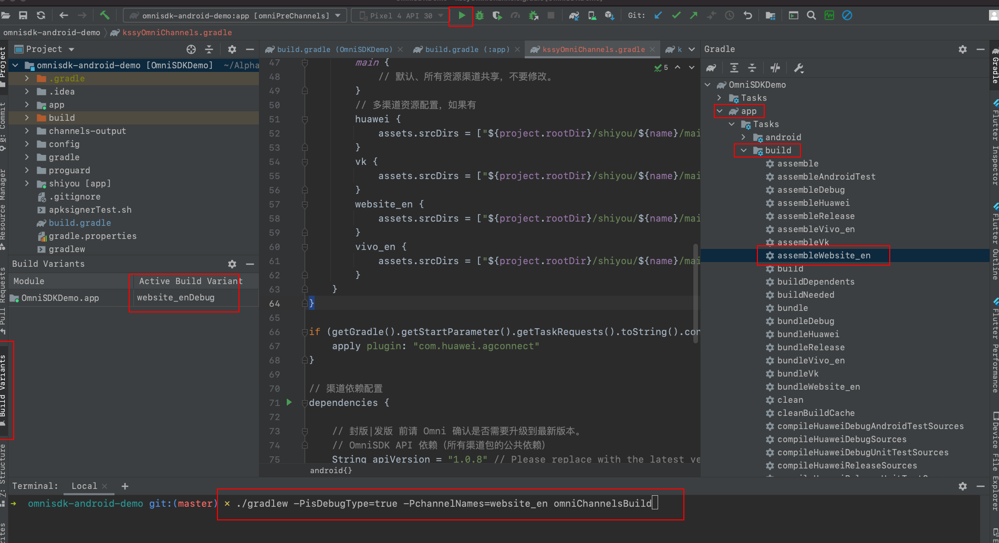
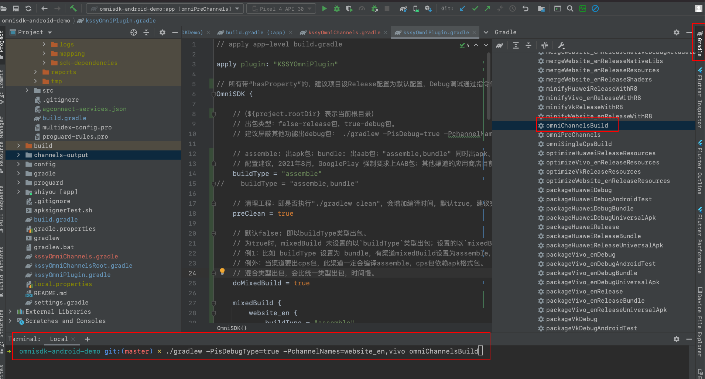

[<<返回上一页](/sdk-docs/docs/omni-sdk/OmniSDK接入指南.md#部分渠道特殊配置)         [返回首页>>](/sdk-docs)

OmniSDK 编译功能高级扩展
=====

<!-- TOC -->

- [描述](#描述)
    - [简介](#简介)
    - [渠道包的标识名](#渠道包的标识名)
    - [只接入一个渠道](#只接入一个渠道)
- [渠道编译](#渠道编译)
    - [单渠道编译](#单渠道编译)
    - [多渠道编译](#多渠道编译)
- [CPS标签包编译](#cps标签包编译)
    - [功能说明](#功能说明)
    - [使用方法](#使用方法)
    - [配置规则](#配置规则)
    - [独立的基础包出CPS标签包](#独立的基础包出cps标签包)
- [参数配置说明](#参数配置说明)
    - [1. 参数说明](#1-参数说明)
        - [渠道编译参数](#渠道编译参数)
        - [CPS标签包编译参数](#cps标签包编译参数)
    - [2. 编译配置示例](#2-编译配置示例)
    - [3. 常用编译指令](#3-常用编译指令)

<!-- /TOC -->

# 描述

## 简介
- `KSSYOmniPlugin` 基于 `Android-Gradle` 编译工具链开发的插件。直接集成于游戏工程源码内，方便游戏编译出包。
- 依赖配置

    ```groovy
    buildscript {
        repositories {
            // 金山世游仓库
            maven {
                url "https://maven.shiyou.kingsoft.com/repository/public/"
            }
        }
        dependencies {
            // 编译插件
            classpath("com.kingsoft.shiyou.omnisdk.build:plugin:$latest_version")
        }
    }
    ```

## 渠道包的标识名
- 渠道包的标识名都由 OmniSDK 定义好，不可更改。
- `/shiyou/` 目录内的一级文件夹名，即渠道包标识名。
- 渠道包标识名，与各自渠道配置文件 `project_config.json#channel.channel_name` 一致。

## 只接入一个渠道
- 如果游戏只接入一个渠道，暂时可以不用看本文档。

# 渠道编译

## 单渠道编译

1. 【Android Studio】***Build > Select Build Variant*** 或 左侧面板 ***Build Variants*** 切换渠道（无对应命令行），然后直接 `Run` 安装。
2. 或命令行 `gradlew -PchannelNames=channelName omniChannelsBuild`，产物路径默认在 **root-level** 下的 `channels-output`。

    

## 多渠道编译
- 所有渠道
    - 命令行1 `gradlew -PchannelNames=all omniChannelsBuild`
    - 命令行2 `gradlew omniChannelsBuild`，文件 ***kssyOmniPlugin.gradle*** 的 `customChannels` 设置为 **all** 时有效。

- 指定渠道
    - 命令行(单个渠道) `gradlew -PchannelNames=channelName omniChannelsBuild`。
    - 命令行(多个渠道) `gradlew -PchannelNames=channelName1,channelName2 omniChannelsBuild`。

- 产物路径默认在 **root-level** 下的 `channels-output`

    

# CPS标签包编译

## 功能说明
- 渠道包需要出 CPS 标签包时使用。
- **毫秒级**出CPS包，不受游戏包大小影响。
- 使用 OmniSDK 提供的 getCpsName 接口获取值。

## 使用方法
1. 在 **root-level** 下的 `shiyou` 目录，对应渠道文件名下，新建命名为 `cps` 的文件。
2. 根据[配置规则](#配置规则)添加需要输出的渠道CPS标签包。
3. 检查文件 ***kssyOmniPlugin.gradle*** 的 `skipCps` 是不是为 `false`（默认为`false`）。

## 配置规则
- 标签包列表的文件名为 `cps`，固定命名，没有文件后缀；
- 一行一个标签包；比如 `[cpsName,outAlias]` 或 `[cpsName]` 为一行；
- 标签包标签（cpsName）命名规则：
    1. 英文、数字、下划线；
    2. 整个文件禁止空格或空格行。
- 标签包产物命名规则为：`cps-[cpsName]-[channelName]-**.apk`；如果配置别名字段 `outAlias`，则是 `outAlias.apk`。
- 不配置 `cps` 文件时，不出标签包。
- 参考文件 [cps](../res/cps)


## 独立的基础包出CPS标签包
- 如果需要用某个独立的基础包单独出CPS标签包，可以通过以下方式获得。
- 必须是签名后的APK基础包，并且未通过cps机制打入过cps信息的。
    1. 配置路径和cps文件
        ```groovy
        OmniCPS {
            baseApk = file("${project.rootDir}/your_apk_path/*.apk")
            cpsFile = file("${project.rootDir}/shiyou/replace_channel_dir_name_or_replace_your_path/cps")
            output = "${project.rootDir}/channels-output/single-cps/"
        }
        ```
    2. 执行命令行 `gradlew omniSingleCpsBuild`
    3. 执行完成到配置的产物路径获取。

# 参数配置说明

## 1. 参数说明

可 :left_right_arrow: 滑动

### 渠道编译参数

| 参数名         | 功能             | 参数值                                                       | 默认值   | 备注                                                         |
| -------------- | ---------------- | ------------------------------------------------------------ | -------- | ------------------------------------------------------------ |
| `buildType*`      | 编译类型         | assemble,bundle                                              | assemble | 1. 渠道包默认编译类型；<br/>2. 如果需要同时出apk、aab格式，可配置"`assemble,bundle`"。 |
| preClean       | 清理工程         | Boolean                                                      | false | 编译前是否清理工程的编译缓存，会增加编译时间，默认false，建议完整出包时设置为true |
| doMixedBuild   | 是否混合类型编译 | Boolean                                                      | false    | 1. false：以 `buildType*` 类型编译；<br/>2. true：`mixedBuild` 未设置则以 `buildType*` 类型编译；设置则以 `mixedBuild-buildType` 类型编译。 |
| mixedBuild     | 混合编译配置     | mixedBuild {<br/>     Channel-Name {<br/>         buildType = "bundle"<br/>     }<br/> } | 无，可选    | 1. 渠道增加编译类型、或与默认编译类型不同时配置；<br/>2. 配置方式：`渠道名 { buildType = "编译类型"}`；<br/>3. buildType 同`buildType*`。 |
| debugBuild     | 出包类型：debug、release | Boolean                                                      | false    | 1. false：Release包；<br/>2. true：Debug包。 |
| logDebug       | 调试Log | Boolean                                                      | false    | 1. project_config.json#debugMode 开关；<br/>2. false：关闭SDK调试Log；<br/>3. true：开启SDK调试Log。 |
| customChannels | 指定部分渠道包编译 | String | all | 1. 不配置或"all"时出所有渠道包；<br/>2. 指定部分渠道包编译。 |
| output         | 产物输出路径 | 绝对路径 | 无 | 不配置默认输出到工程根目录下channels-output文件夹。 |
| skipCps        | 是否跳过cps标签包编译 | Boolean                                                      | false    | 1. false：编译CPS包；<br/>2. true：跳过。 |

### CPS标签包编译参数

| 参数名  | 功能         | 参数值       | 备注                                                         |
| ------- | ------------ | ------------ | ------------------------------------------------------------ |
| baseApk | 基础apk      | 绝对路径文件 | 签过名的基础apk，且未打入cps信息，不满足无效。               |
| cpsFile | cps标签文件  | 绝对路径文件 | 同cpsChannels                                                |
| output  | 产物输出路径 | 绝对路径     | 不配置默认输出到工程根目录下channels-output/single-cps/文件夹。 |


## 2. 编译配置示例
- 默认配置文件 [kssyOmniPlugin.gradle](../res/kssyOmniPlugin.gradle)
- 修改配置前阅读相关注释。

## 3. 常用编译指令

| 功能            | 命令                                                         | 备注                                 |
| --------------- | ------------------------------------------------------------ | ------------------------------------ |
|综合编译指令|gradlew build|会执行编译相关的所有task，产物包括Debug、Release包两种，并进行一些代码编译时错误检查等；建议游戏正式出包时运行一次。|
| 预编译-生成配置 | gradlew omniPreChannels                                    | omniPreChannels 可用 omniPC 替换     |
| 多渠道包编译    | gradlew omniChannelsBuild                                  | omniChannelsBuild 可用 omniCB 替换   |
| 标签包编译      | gradlew omniSingleCpsBuild                                 | omniSingleCpsBuild 可用 omniSCB 替换 |
| 编译示例        | gradlew app:assemble[Channelname]Release                     | 指定编译某个渠道的release包                 |
| 编译示例        | gradlew app:assemble[Channelname]Debug                       |指定编译某个渠道的debug包|
| 传参数示例    | gradlew -PopenLog=true omniChannelsBuild                | 编译all渠道release包（默认），并打开调试日志 |
| 传参数示例      | gradlew -PisDebugType=true -PchannelNames=website_en,samsung omniCB | 编译website_en、samsung渠道的debug包 |
| 传参数示例      | gradlew -PisDebugType=false -PskipCpsBuild=false omniChannelsBuild | 编译all渠道release包并出相应渠道的cps标签包 |

