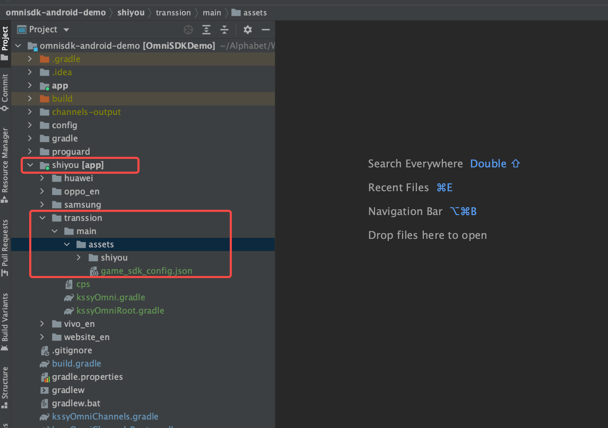

[<<返回上一页](/sdk-docs/docs/omni-sdk/OmniSDK接入指南.md#高级扩展)         [返回首页>>](/sdk-docs)

OmniSDK 部分渠道特殊配置
=====

<!-- TOC -->

- [huawei（华为渠道）](#huawei华为渠道)
- [transsion（传音渠道）](#transsion传音渠道)

<!-- /TOC -->

# huawei（华为渠道）
- 接入华为渠道时，需要在 **root-level** 下的 ***build.gradle***，添加如下配置:
  
  ```groovy
   buildscript {
       repositories {
           // 如果有接入华为渠道，还需要手动声明这个依赖仓库，本配置不影响其他渠道。
           maven {
               url "https://developer.huawei.com/repo/"
           }
       }
   }
  ```
  
- 需要在 **app-level**，添加 ***agconnect-services.json*** 文件。
    - 此文件由项目商务或运营向华为申请后提供，OmniSDK 不介入。
    - 游戏直接添加，可与其他渠道共存，不影响相互编译、打包、功能。
  
        

# transsion（传音渠道）
- 接入传音渠道，需要在 **root-level** 下 `shiyou/transsion/main/assets/` 添加 ***game_sdk_config.json*** 文件。
    - 此文件由项目商务或运营向华为申请后提供，OmniSDK 不介入。
    - 游戏直接添加，可与其他渠道共存，不影响相互编译、打包、功能。
      
        