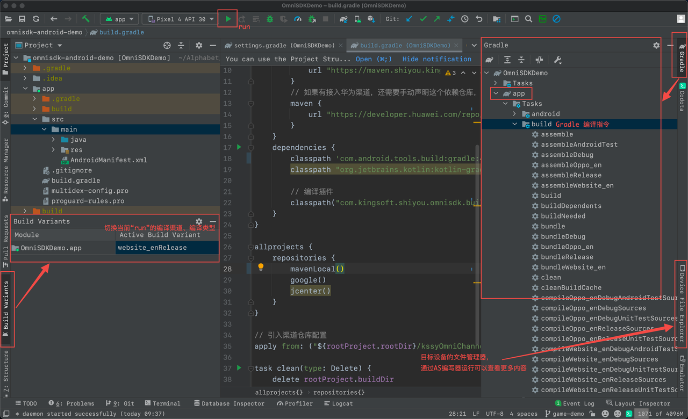

[<<返回上一页](/docs/omni-sdk/OmniSDK接入指南.md#通用编译与CPS标签包)         [返回首页>>](/sdk-docs)

OmniSDK 通用编译与CPS标签包
=====

<!-- TOC -->

- [版本](#版本)
- [术语](#术语)
- [渠道调试](#渠道调试)
- [渠道出包](#渠道出包)
- [多渠道出包](#多渠道出包)
    - [命令行](#命令行)
    - [图形界面](#图形界面)
- [CPS标签包](#cps标签包)
    - [功能说明](#功能说明)
    - [使用方法](#使用方法)
    - [配置规则](#配置规则)
- [常用指令](#常用指令)
- [高级扩展](#高级扩展)
- [手动编译配置](#手动编译配置)

<!-- /TOC -->

# 版本

- 请确保 KSSYOmniPlugin 使用[最新版本](https://d7n9vj8ces.feishu.cn/docs/doccn9IsNVuJKFHQb1BqbxYHcdd#HBROJv)。

# 术语

- release: release包，即正式发行包。
- debug: debug包，即测试包。
- Channelname：根目录下 `shiyou` 文件夹内一级文件夹名即为定义好的渠道名。
- app: 指代 app-level 主工程目录的文件夹名（如不一样，以引擎命名代替）。

# 渠道调试
> 这个没有对应的命令行指令

【Android Studio】***Build > Select Build Variant*** 或 左侧面板 ***Build Variants*** 切换渠道，然后就可以进行渠道的代码调试。

# 渠道出包

1. 手机连接电脑后，点击【Android Studio】`Run`，即可自动编译当前渠道并安装。
2. 通过【Android Studio】Build > Build Bundle(s) / APK(s)，编译出包。
3. 命令行
    - 编译：`gradlew app:assemble[Channelname]Release`（驼峰规则）
        - 示例：`gradlew app:assembleWebsite_enRelease`
    - 安装：`adb install /path/*.apk` 
4. **引擎IDE 出包，底层原理是一致的**。

# 多渠道出包

## 命令行
- `gradlew omniChannelsBuild`: OmniSDK 提供的多渠道编译指令集。
- 如需要定制出包规则，参考[高级扩展](#高级扩展)

## 图形界面

- 规划中：Java GUI，本质上还是命令行。

# CPS标签包

## 功能说明
- 渠道包需要出 CPS 标签包时使用。
- **毫秒级**出CPS包，不受游戏包大小影响。
- 使用 OmniSDK 提供的 getCpsName 接口获取值。

## 使用方法
1. 在 **root-level** 下的 `shiyou` 目录，对应渠道文件名下，新建命名为 `cps` 的文件。
2. 根据[配置规则](#配置规则)添加需要输出的渠道CPS标签包。
3. 检查文件 ***kssyOmniPlugin.gradle*** 的 `skipCps` 是不是为 `false`（默认为`false`）。

## 配置规则
- 标签包列表的文件名为 `cps`，固定命名，没有文件后缀；
- 一行一个标签包；比如 `[cpsName,outAlias]` 或 `[cpsName]` 为一行；
- 标签包标签（cpsName）命名规则：
    1. 英文、数字、下划线；
    2. 整个文件禁止空格或空格行。
- 标签包产物命名规则为：`cps-[cpsName]-[channelName]-**.apk`；如果配置别名字段 `outAlias`，则是 `outAlias.apk`。
- 不配置 `cps` 文件时，不出标签包。
- 参考文件 [cps](../res/cps)

# 常用指令

| 指令名                                                       | 功能                                                         | 产物路径                        |
| ------------------------------------------------------------ | ------------------------------------------------------------ | ------------------------------- |
| gradlew bulid                                                | 执行所有Task，包含debug、release；如果有多个渠道也会同时编译 | app-level/build/outputs/apk     |
| gradlew app:assemble[Channelname]Release                     | 指定编译某个渠道的release包                                  | 同上                            |
| gradlew app:assemble[Channelname]Debug                       | 指定编译某个渠道的debug包                                    | 同上                            |
| gradlew omniChannelsBuild                                    | OmniSDK 提供的多渠道编译指令集                               | 默认根目录的 channels-output 下 |
| gradlew -PisDebugType=true -PskipCpsBuild=false omniChannelsBuild | 编译渠道debug包并出相应渠道的cps标签包                       | 默认根目录的 channels-output 下 |

# 高级扩展
[OmniSDK 编译功能高级扩展](../doc/AdvancedCompilation.md)

# 手动编译配置
- 不建议。
- [手动编译配置](../doc/手动编译配置.md)