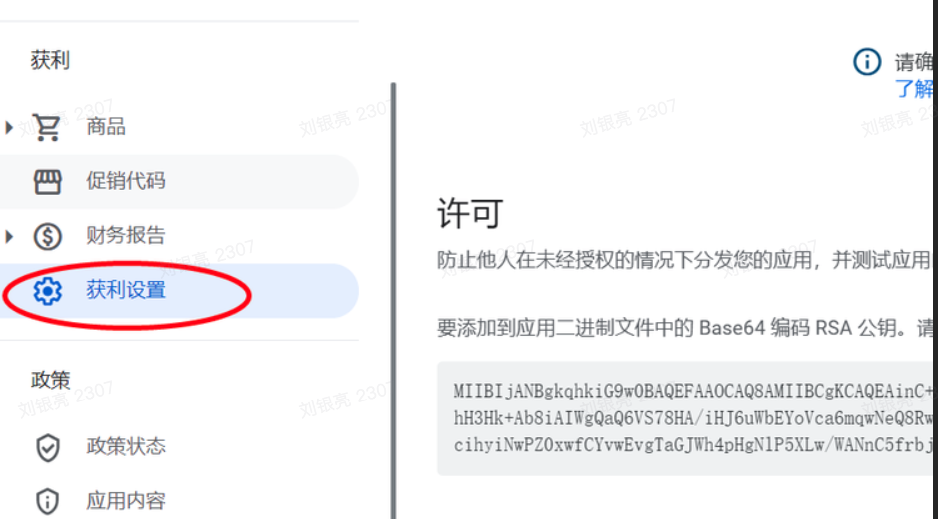
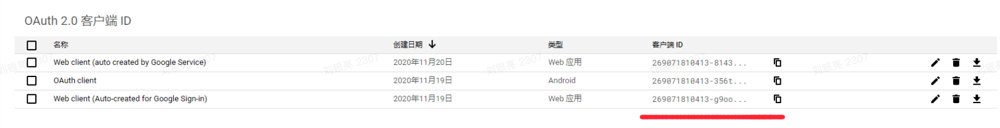
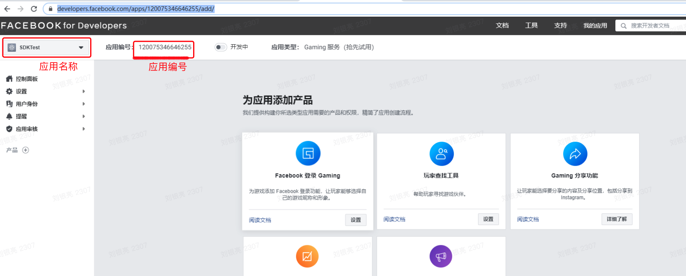

[<<返回首页](/sdk-docs)

参数获取说明
======

# Google 参数获取
当前接入 Google 渠道需要两个参数：[Googlekey, googleServerClientId]，这两个参数在 SGSDK 后台的Google配置参数对应。

### Googlekey 获取

登录 Google 开发者后台，进入【获利】功能页，在一下图示中位置获取许可，即 Googlekey：

### googleServerClientId 获取
进入 Google 后台的应用配置中，找到 OAuth2.0 客户端ID，复制出来即可

Google 官方接入指南：[Google 登录](https://developers.google.com/identity/sign-in/android/start-integrating#configure_a_console_name_project)

# Facebook 参数获取
当前接入 Facebook 渠道需要三个参数：[facebookAppId, facebookAppName, facebookLoginProtocolScheme]，这两个参数在 SGSDK 后台的 Facebook 配置参数对应。

获取见下图：

facebookAppId ：应用ID
facebookAppName ：应用名称
facebookLoginProtocolScheme ： 由 “fb” + facebookAppId 构成，如 “fb120075346646255”