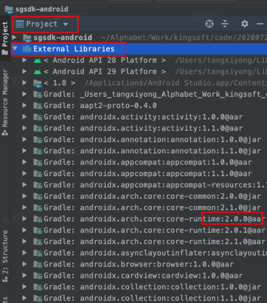
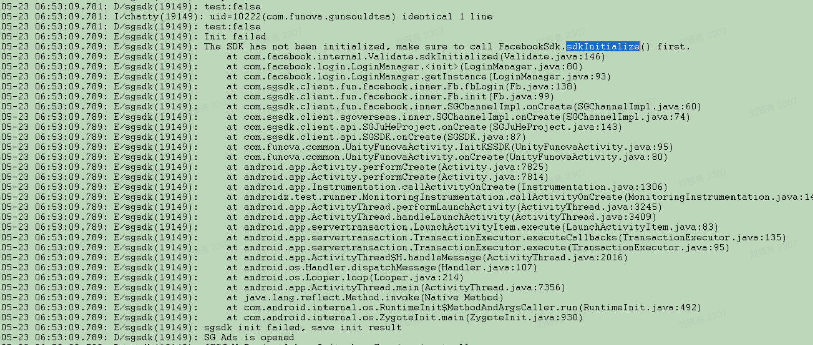
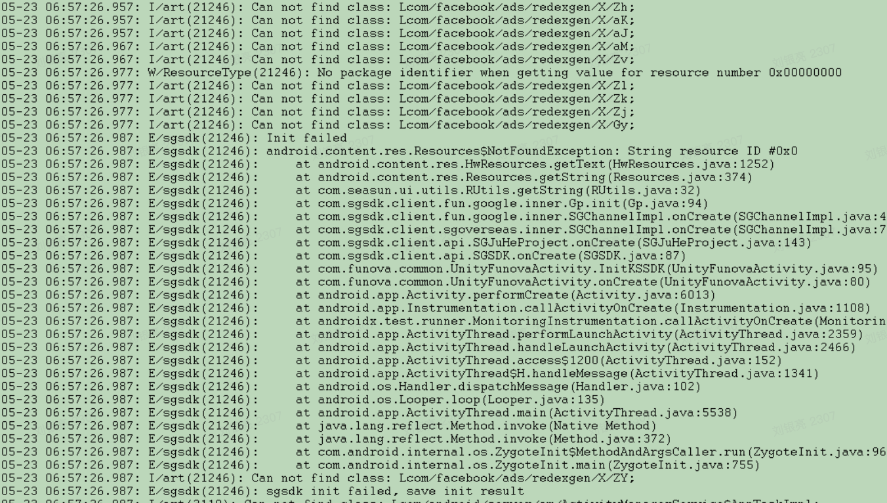
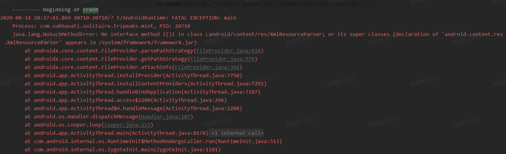
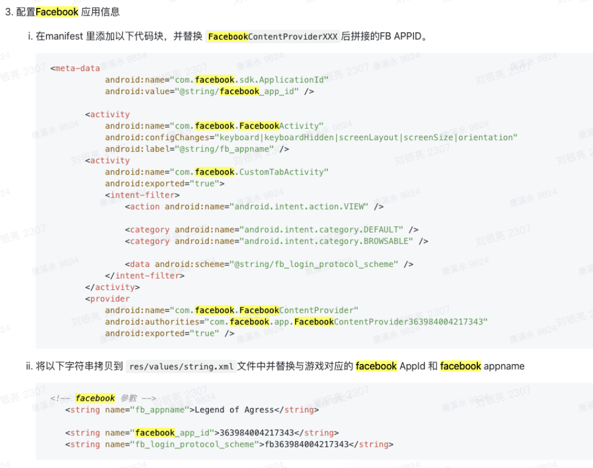

# SGSDK FAQ

> 如仅某机型无法正常使用功能时，查看下面的multidex相关问题

## 1. 第三方sdk版本号查询
在 Android Studio 工程目录切换成 “Project”，然后查找对应依赖库(sdk)的版本.



## 2. Manifest merger failed : Attribute application@fullBackupContent
如果你在开启AF数据上报后编译时出现以上错误，请在您的 Manfifest 的 application 标签下添加`tools:replace="android:fullBackupContent`,
如果同时开启了 广告流量变现，添加以上字符串依然报错，请再添加以下字符串：`android:fullBackupContent="true"`     例如：
```xml
<application
    android:name="com.sgsdk.client.api.SGApplication"
    android:allowBackup="true"
    android:theme="@android:style/Theme.Translucent.NoTitleBar.Fullscreen"
    android:fullBackupContent="true"
    tools:replace="android:fullBackupContent">
</application>
```

## 3. 启动crash，日志体现：Facebook 初始化失败，如图：

原因：游戏未在清单文件中配置 Facebook 相关配置项。
解决：
1. 请确认是否重写了 SGSDK 提供的Activity 生命周期方法。
2. 请确认 facebook 的依赖是否已经添加。
3. 请检查 facebook 的相关配置是否已经添加，具体可参考文档（接入文档中 facebook 接入相关）进行 facebook 相关配置。

## 4. 启动crash ,日志显示找不到 google 相关资源，如图

原因：游戏未在 string.xml 文件中配置 google client id，初始化时找不到对应资源。<br>
解决：请根据接入文档 （Google 登录接入相关）增加 google client id 相关配置。

## 5. 接入 AppsFlyer（或 vungle ） 时编译出现 Manifest merger failed : Attribute application@fullBackupContent
解决：如果你在开启AF数据上报后编译时出现以上错误，请在您的Manfifest 的application 标签下添加`tools:replace="android:fullBackupContent`
```xml
<application
        android:name="com.sgsdk.client.api.SGApplication"
        android:allowBackup="true"
        .....
        android:theme="@android:style/Theme.Translucent.NoTitleBar.Fullscreen"
        android:fullBackupContent="true"
        tools:replace="android:fullBackupContent">
        .....
 </application>
```

## 6. 5.0 以下系统 开启multidex 后无法启动
原因：5.0 以下系统在多分包的情况下，在启动时需要的类无法在主dex 中找到就会crash ,5.0 以上已修复此问题。
解决：可参考 Android developer 官网配置将启动需要的类保持在主 dex 中，如需开启多dex,可联系 我方技术人员获取 `multidex-config.pro` 文件。并在您的 `build.gradle` 文件下buildTypes 中添加 `multiDexKeepProguard file('multidex-config.pro')`, 并将 我方提供的 `multidex-config.pro` 文件放到您项目的跟目录下。
官网解决方案如下：https://developer.android.com/studio/build/multidex

> multidex-config.pro 在 sgsdk-android-demo 里提供。

## 7. 5.0 以下系统 开启multidex 后 游客账号切换账号 crash 问题
5.0 以下的 Application 需要使用MultiDexApplication
解决方案
如果您的Application 是继承SGApplication ,请重写 attachBaseContext方法并在改方法下，调用` MultiDex.install(this);` 例如:
```java
@Override
protected void attachBaseContext(Context base) {
    super.attachBaseContext(base);
     MultiDex.install(base); 
}
```
如果您是新建 的 Application,也可以选择让新建的 Application 继承 MultiDexApplication

## 8. 接入 4.11.0 以上版本的 AppsFlyer ，打开混淆打包时报错：Excepting class member name before
- 检查 混淆文件中是否有 -dontwarn com.appsflyer.** 混淆规则。
- 将gradle 工具升级到 3.5+ 版本以上。修改方法：在项目工程根目录下的 build.gradle 文件中修改 classpath 'com.android.tools.build:gradle:3.5.1' 修改版本号.
```java
buildscript {
    repositories {
        jcenter()
        // your code
    }
    dependencies {
        classpath 'com.android.tools.build:gradle:3.2.0'
    }
}
```

## 9. 茄子包provider安装冲突
在./app/build.gradle 配置下下述参数
```java
android {
        defaultConfig {
        //SHAREit begin
        resValue "string", "account_type", "${applicationId}.type"
        resValue "string", "content_authority", "${applicationId}.provider"
        //SHAREit end
        }
}
```

## 10. java.lang.NoSuchMethodError: No ***XmlResourceParser

解决方法：添加下述混淆配置
```
-keep class org.xmlpull.v1.** { *;}
-dontwarn org.xmlpull.v1.**
```

## 11. 切换Facebook appId
与 SGSDK 没有关系。
- 检查 Facebook 后台配置
- SGSDK 1.0.6以前版本检查下图配置

- SGSDK 1.0.6及以上检查 sgsdk_config.properties 文件
- 如果是测试，要添加测试设备。
详细查看 Facebook 官方文档：https://developers.facebook.com/docs/facebook-login/testing-your-login-flow

## 12. 参数替换问题
> 通常一个包名对应一套参数，特别是google、facebook之类的三方sdk。
- 如果不需要QA验证，同时只是替换 sgsdk_config.properties 文件内的参数，那么保证参数正确的前提，可以不用打包，而由接入人员直接替换 sgsdk_config.properties 文件，而后进行游戏测试。
- 替换三方sdk的参数，请按流程：旧参数怎么生成、配置的，新参数请按原流血也怎么生成、配置，而后替换相应节点