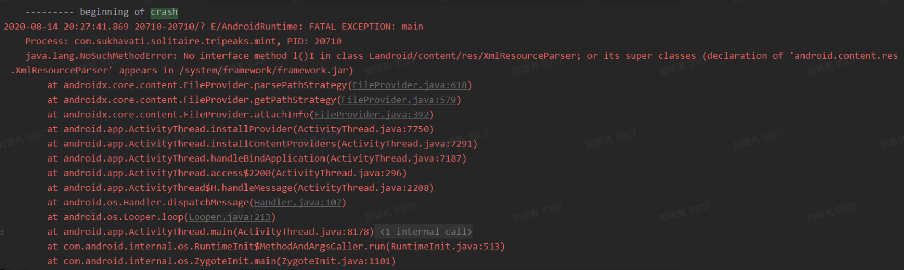
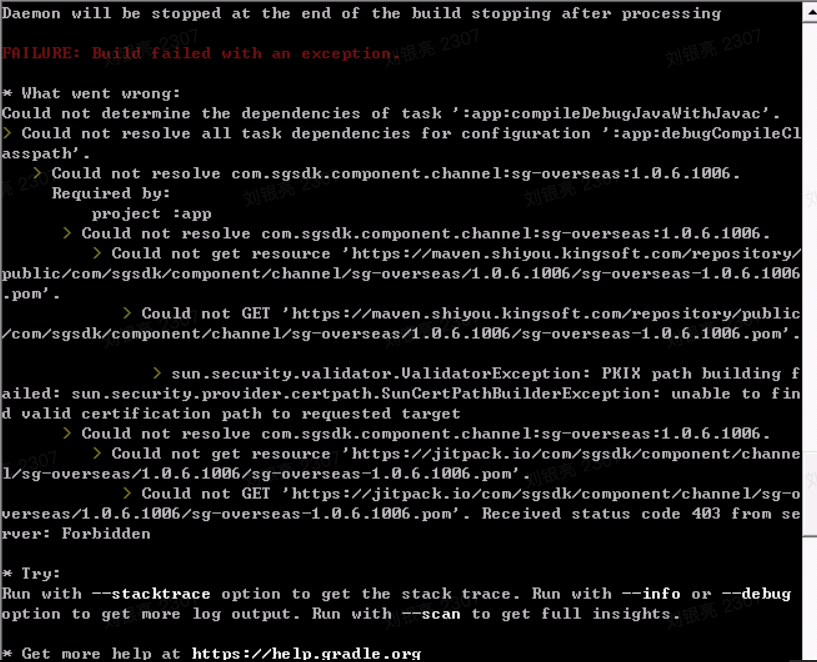

# SGSDK Android 编译问题汇总
> 出现sync fail、依赖下载失败:
1. 检查电脑代理环境；
2. 检查工程下gradle.properties是否有代理配置；
3. 检查 AS代理设置 |Preferences | Appearance & Behavior | System Settings | HTTP Proxy
4. 菜单栏-Build-Clean Project
5. 菜单栏-File-Invalidate Caches-Invalidate And Restart
6. 重启电脑
7. 删除 .gradle/caches/transforms-2，甚至.gradle/caches/，重启电脑

如果编译失败，提示信息 "/.gradle/caches/transforms-2/files-2.1/**"，原因与SGSDK无关，通常是电脑编译环境问题，请先按以上步骤排查。

# 一、常见编译问题
## 1. Duplicate files copied in APK META-INF/DEPENDENCIES when compile
```java
// build.gradle(Moudle:app - or Moudle:main-name)/build.gradle  加上这个
android {
    packagingOptions {
        exclude 'META-INF/DEPENDENCIES'
    }
}
```

## 2. Execution failed for task 'app:processDebugManifest'.
出现以上提示通常是 AndroidManifest.xml 资源配置冲突，请按提示配置以解决冲突

## 3. AndroidManifest.xml 节点冲突
SGSDK 对 AndroidManifest 的节点内部做了兼容，如果因与其他依赖库冲突，在冲突节点加上以下配置
```java
tools:node="merge"

// demo
<meta-data
    android:name="name"
    android:value="name"
    tools:node="merge" />
```

# 二、茄子 1.8.0.1 升级解决方案
> 因茄子 1.8.0.1  SDK的内部升级原因，无法再支持 gradle tools 3.4.0 以下的低版本
## 1. 方案一：升级编译版本
建议编译版本配置及高版本
```java
// ./build.gradle
classpath 'com.android.tools.build:gradle:3.6.3'
```

```java
# ./gradle/wrapper/gradle-wrapper.properties
distributionUrl=https\://services.gradle.org/distributions/gradle-5.6.4-all.zip
```
## 2. 方案二：如果游戏引擎无法升级，可以在 kssgconfig.gradle 添加以下配置
```java
android {
    // configurations 参考位置
  }
configurations {
    all {
        resolutionStrategy.force 'com.google.code.gson:gson:2.8.5'
    }
}
```
## 3. 如果启动失败添加以下混淆配置
```
-keep class org.xmlpull.v1.** { *;}
-dontwarn org.xmlpull.v1.**
```

## 4. java.lang.NoSuchMethodError: No interface *** XmlResourceParser
请检查混淆配置，即第2点的“xmlpull”是否按文档配置


## 5. 茄子包provider安装冲突【重点】
v1.0.6 在./app/build.gradle 配置下下述参数，v1.0.7 开始已在 kssgconfig.gradle内配置
```java
android {
        defaultConfig {
        //SHAREit begin
        resValue "string", "account_type", "${applicationId}.type"
        resValue "string", "content_authority", "${applicationId}.provider"
        //SHAREit end
        }
}
```
## 6. 去除 vungle 包
```java
android {
      // configurations 参考位置
    }
    configurations {
      all {
        // 如果需要去除 vungle 包
        exclude(group: "com.vungle", module: "publisher-sdk-android")
      }
}
```

# 三、Could not resolve

### 1. 依赖库不存在
通过访问 https://maven.shiyou.kingsoft.com/repository/public/ 确认对应的依赖库是否存在，如果不存在，请确认发行商提供的版本是否正确。
### 2. 网络不通
请检查代理等网络环境，确保能够正常访问 https://maven.shiyou.kingsoft.com/repository/public/
### 3. 证书的问题
参考此文章 https://www.iteye.com/blog/bijian1013-2310856