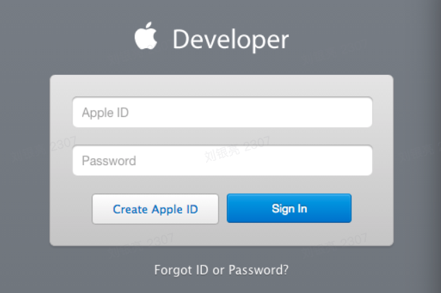

## Apple开发者帐户证书管理及SGSDK项目配置

### 1. 准备开始
#### 1.1 参考资料证书配置描述文件
使用入门：[简体中文官方文档地址](https://help.apple.com/developer-account/?lang=zh-cn#/dev4c557019f)

#### 1.2 开发证书配置
iOS的证书配置比较繁琐，一般包括开发证书和生产证书。在配置证书之前，请确保你有一个iOS开发者账号及一台苹果电脑。（仅提供开发证书的配置教程，生产证书同理）。

#### 1.3 证书配置的主要流程为
1. 申请钥匙串证书（密钥文件）；
2. 登录iOS开发者账号，创建App IDs（即项目的Bundle ID）；
3. 注册开发者真机调试的设备；
4. 创建Certificates证书，主要用于苹果服务器识别电脑是否具有密钥文件进行签名；
5. 创建Provisioning Profiles证书，主要用于Xcode使用密钥文件进行ipa签名；
6. 下载Certificates证书和Provisioning Profiles证书，安装（双击即可）。

#### 1.4 准备工作
如果想要进行iOS开发，首先要具备下面一些条件：
- 苹果开发者账户。开发者账号分为Individual（个人或公司开发者账号$99）和Company/Organization（企业开发者账号$299）两种类型。
- 若要进行真机调试，必须至少拥有一台装有Mac OS X/Xcode的Mac开发机（iMac or MacBook）

### 2. 登录开发者中心
如果已经拥有苹果开发者账号，直接登录苹果开发者中心申请开发证书，登录地址 -> https://link.jianshu.com/?t=https://developer.apple.com/account/ios

**1 - 登录界面示例：**

**2 - 选择“Certificates, Identifiers & Profiles”项进入后显示下面界面，iOS Apps一栏中任意选择一项**

**3 - 进入界面示例**

下面一小节分别对上图中的四个划横线的概念进行介绍：

### 3. 关键概念说明
#### 3.1 Identifiers
Identifiers 即标识符，相当于身份证，用于创建以下三个ID：[App IDs, Pass Type IDs, Website Push IDs]，一般我们只用 App IDs

App IDs

App ID是应用的唯一标识符，和Xcode中的Bundle Identifier是一致（Explicit）的或匹配（Wildcard）的（如下图所示）。App ID字符串通常以反域名（reverse-domain-name）格式的Company Identifier（Company ID）作为前缀（Prefix/Seed），一般不超过255个ASCII字符。- 用户可在Developer MemberCenter网站上注册（Register）或删除（Delete）已注册的App IDs。

App IDs
- 在“ Identifiers”一栏下选择“App IDs”，可查看所有已申请的App IDs,点击右上“＋”

- 进入Register iOS App ID界面，在“App ID Description”栏下的“Name”项中输入名称

 
 
在“Explicit App ID”栏下的“Bundle ID”项中输入App ID（反域名格式，如：com.company.test），这里“Bundle ID”对应Xcode中的“Bundle identifier”。 
Explicit App ID：唯一的App ID，用于唯一标识一个应用程序。例如“com.apple.garageband”这个App ID，用于标识Bundle Identifier为“com.apple.garageband”的App。 
Wildcard App ID：含有通配符的App ID，用于标识一组应用程序。例如“”（实际上是Application Identifier Prefix）表示所有应用程序；而“com.apple.”可以表示Bundle Identifier以“com.apple.”开头（苹果公司）的所有应用程序。 
在“App Services”栏下选择应用要使用到的服务（如要使用推送功能，勾选“Push Notifications”）.最后点击continue->点击submit->点击done，申请App IDs完成。点击All IDs可查看申请的ID，点击该ID： 
 

#### 3.2 Certificates
iOS证书是用来证明iOS App内容（executable code）的合法性和完整性的数字证书。对于想安装到真机或发布到AppStore的应用程序（App），只有经过签名验证（Signature Validated）才能确保来源可信，并且保证App内容是完整、未经篡改的。数字证书是一个经证书授权中心数字签名的包含公开密钥拥有者信息以及公开密钥的文件。具有时效性，只在特定的时间段内有效。

iOS证书分两种：开发证书（Development）和生产证书（Production）:
- 开发证书用于开发和调试应用程序，可用于联机调试。
- 生产证书用来发布应用程序。

生成证书请求文件（CSR） 
可以通过Keychain（钥匙串）证书助理从证书颁发机构请求证书。在iOS Dev Center中添加证书（Certificates）时，需要上传改CSR文件。打开Keychain（钥匙串），点击菜单栏“钥匙串访问”->“证书助理”->“从证书颁发机构请求证书”: 
 
填写开发账号邮件和常用名称，勾选“存储到磁盘”。 
 
Request）文件。同时，Keychain Access->Keys（密钥）中增加一对Public/Private Key Pair。 
 
- 私钥（private key）始终保存在Mac OS的Keychain Access中，用于签名（CodeSign）对外发布的App。
- 公钥（public key）一般随证书散布出去，对App签名进行校验认证。
申请证书 
进入iOS 开发者中心，“Certificate”->“All”,点击右上角“＋”（也可直接点击“Certificate”下的“Development”或“Production”，直接选择申请开发证书或生产证书），进入如下界面： 
 
选择开发证书或者生产证书，这里以生产证书为例，继续 
 
选择App ID，即我们在“ Identifiers”中创建的App ID，继续
 
这里介绍如何生产证书请求文件，即我们在“2.2.2. 生成证书请求文件（CSR）”中生成的.certSigningRequest文件，这里继续 
 
这里需要添加生成的证书请求文件（CSR），“Choose File”选择生成的.certSigningRequest文件，点击“Generate”，如图申请开发证书完成，申请生产证书流程类似，这里不再赘述。
 
我们可以点击“Download”下载该开发证书，或者在“Certificates”->“All”中查看该证书，并进行下载或删除，如图： 
 
下载证书，双击导入Keychain Access，可在Keychain Access->“证书”中查看，展开安装的证书（ios_development.cer）前面的箭头，可以看到其对应的私钥。在KeychainAccess->“密钥”中展开创建CSR时生成的Key Pair中的私钥前面的箭头，可以查看到包含其对应公钥的证书。

导出证书 
打开Keychain Access，选择安装成功的证书，右键选择“导出” 
 
输入名字，默认格式为.p12类型，选择“Save”，最后- 设置密码，点击“OK”即可。 

#### 3.3 Devices
Device是指运行iOS系统用于开发调试App的设备（即苹果设备）。每台Apple设备使用UDID来唯一标识，设备的UDID可通过iTunes->Summary或者Xcode->Window->Devices获取。开发描述文件（Provisioning Profiles）必须绑定设备，所以在申请开发描述文件之前，必须要添加调试的设备（已添加可跳过）。 

添加调试设备 
进入iOS Dev Center，“Devices”下选择“All",可查看所有已添加的设备，点击右上角“＋”添加新的调试设备 
 
输入“Name”和UDID（可在xcode或者iTunes中查看）后，继续 
 
确认信息后，点击注册，完成添加

#### 3.4 Provisioning Profiles
Provisioning Profile文件包含了上述所有内容：证书，App ID，设备，后缀名为.mobileprovision。 
1. 一个Provisioning Profile对应一个Explicit App ID或Wildcard App ID。
2. Provisioning Profile决定Xcode用哪个证书（公钥）/私钥组合（Key Pair/Signing Identity）来签名应用程序（Signing Product）,将在应用程序打包时嵌入到.ipa包里。
3. Provisioning Profile把这些信息全部打包在一起，方便我们在调试和发布程序打包时使用。这样，只要在不同的情况下选择不同的Provisioning Profile文件就可以了。
4. Provisioning Profile也分为Development和Distribution两类，有效期同Certificate一样。Development版本的ProvisioningProfile用于开发调试，Distribution版本的ProvisioningProfile主要用于提交App Store审核，其不指定开发测试的Devices。
5. xcode开发时，需在XcodeTarget->Build Settings->Code Signing->Provisioning Profile下配置对应的描述文件（Provisioning Profiles），然后在Code Signing Identity下拉可选择Identities from Profile "..."（即Provisioning Profile中包含的Certificates）。
6. 在XcodeTarget->Build Settings->Code Signing->Provisioning Profile可选择“Automatic”，xcode会根据该Target的“Bundle identifier”选择默认的配置文件及证书。
 

创建配置文件 
打开 iOS 开发者中心，“Provisioning Profiles”->“All”,点击右上角“＋”（也可直接点击“Development”或“Production”） 
 
选择开发或发布证书配置文件，这里以开发为例，点击iOS App Development，继续 
 
选择对应的App ID，继续
 
 
 
选择用于调试安装的设备(最多100台设备)，如果是生产证书配置文件，则不会出现该页面（生产证书用于发布，不能进行开发调试），继续看到以下界面 
 
输入文件名后，点击“Generate”，配置文件创建成功
 
可点击“Download”进行下载，或者在“Provisioning Profiles”->“All”查看所有配置文件，并进行下载或删除等操作。
 
如图下载到本地的Provisioning Profile，双击自动安装到xcode中，在XcodeTarget->Build Settings->Code Signing->Provisioning Profile中可看到此项 
 
如图，选择此项配置文件，“Code Signing Identity”中会默认显示所关联的证书文件（即创建该配置文件时选择关联的证书，可有多个） 
 
生产证书配置文件与之类似，不再赘述。

### 3. SG 后台配置
创建应用后，创建包含 Apple 发布计划进行参数配置： 
 
友情提示： 
1. 该配置仅为iOS移动端配置，随着苹果开发者官方管理后台的变化有些部分可能有些变动。
2. 开发环境 创建项目需要提供项目开发商ID，应用名称，应用描述，区服信息（海外，全国），应用类型，支付回调地址，SGSDK开发环境配置可联系对应研发同学。